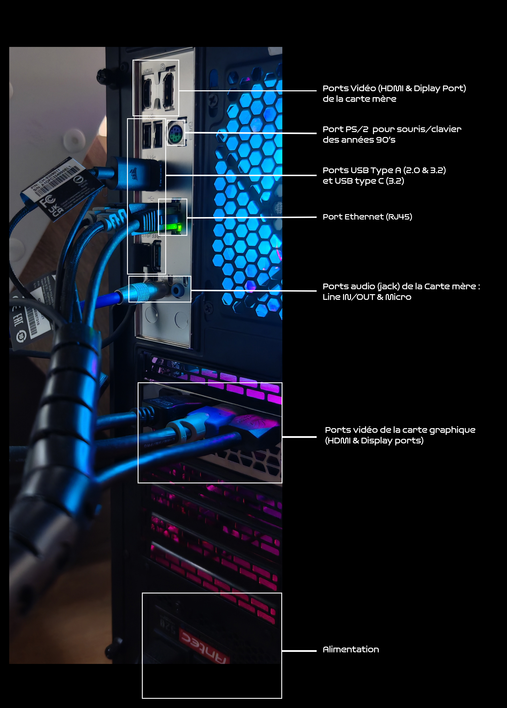
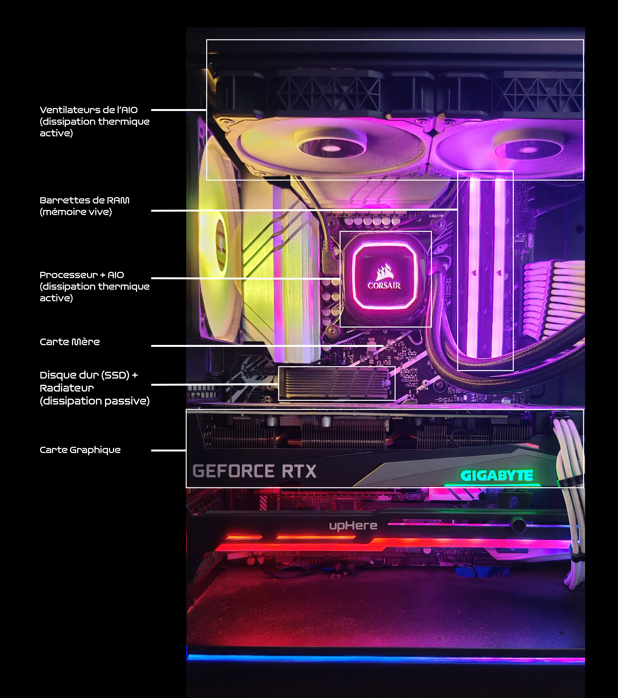
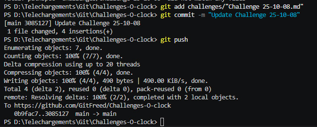

# Pitch de l’exercice

Prenez en photo les différents connecteurs présents sur votre ordinateur, cherchez le nom (le plus précis possible) de chaque port présent sur votre machine.

Pour ceux qui ont un PC fixe : ouvrez la façade de votre ordinateur (hors tension / après l’avoir débranché ⚠️) et prenez une photo des composants à l’intérieur. Essayez d’identifier chaque composant présent dans votre ordi !
Pour ceux qui n’ont pas de PC fixe ou ne souhaitent pas l’ouvrir, utilisez une photo d’un PC fixe ouvert trouvée sur le web pour faire le même exercice.

---

## Connecteurs présents à l'arrière de l'ordinateur

Voici le PC vu de l’extérieur :

Il y a également 2 ports USB et un port Jack à l'avant du boitier.

## Composants à l'intérieur de l'ordinateur

### PATH OF DOUBLE PAIN

Installer git en local, le config, le lier, et comprendre le git commit push etc 

C'était plus simple via le web direct, vu tout ce qu'il faut taper pour un seul update 🥵

