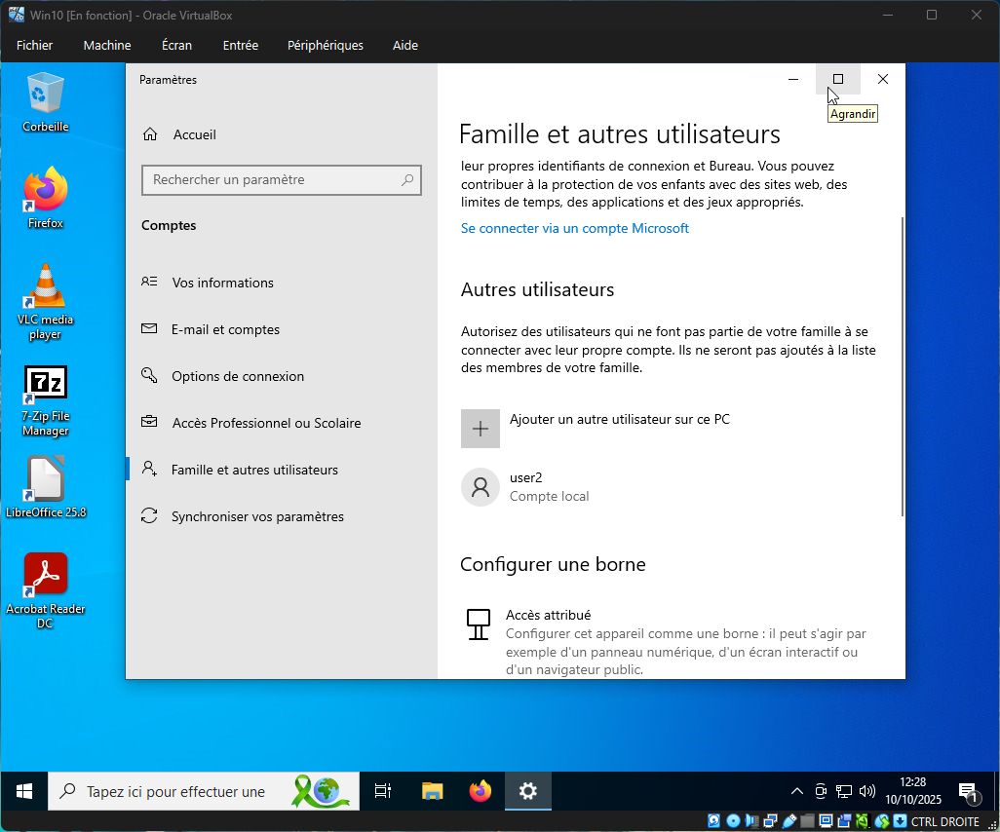
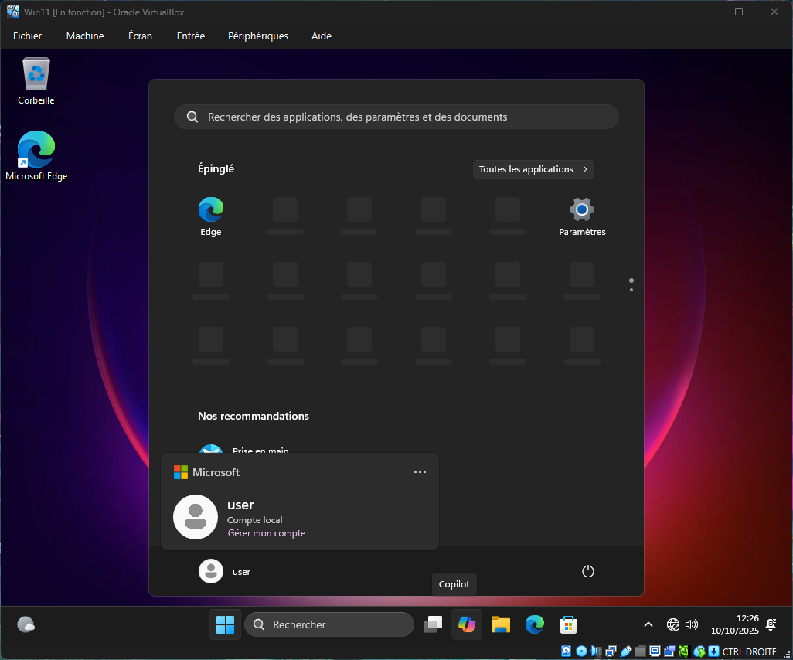
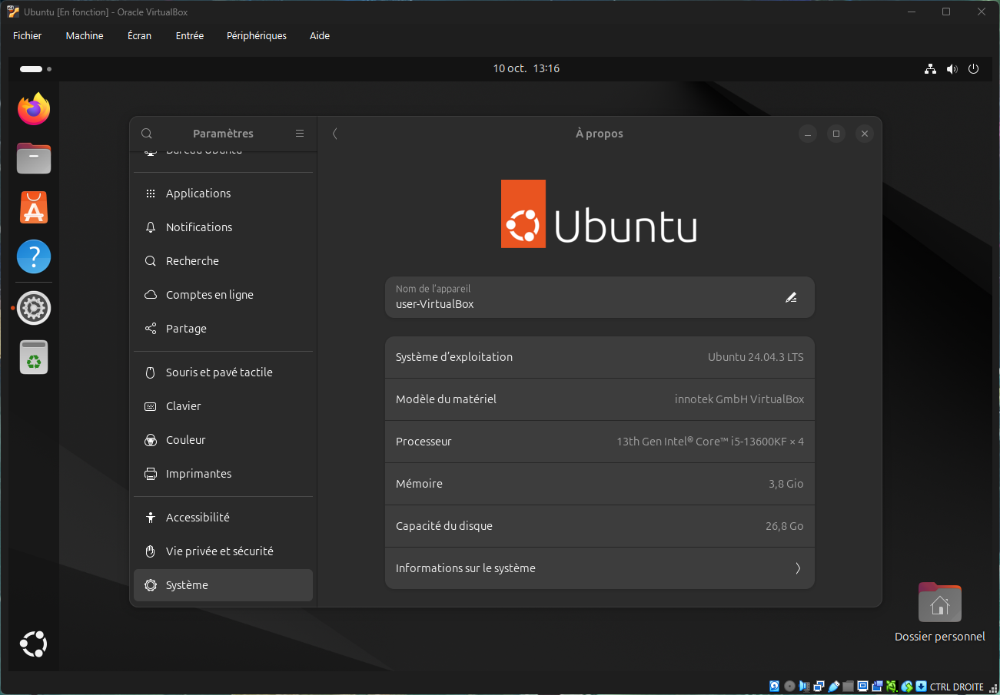
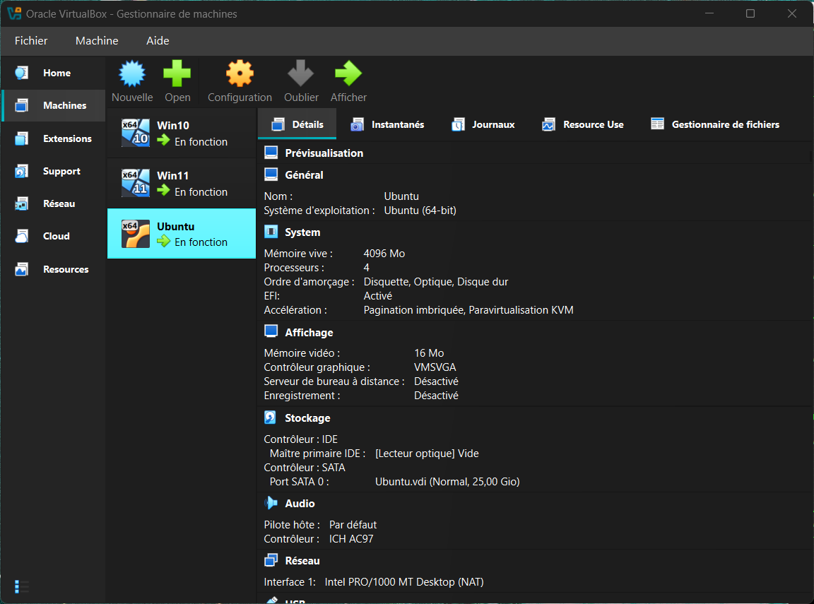
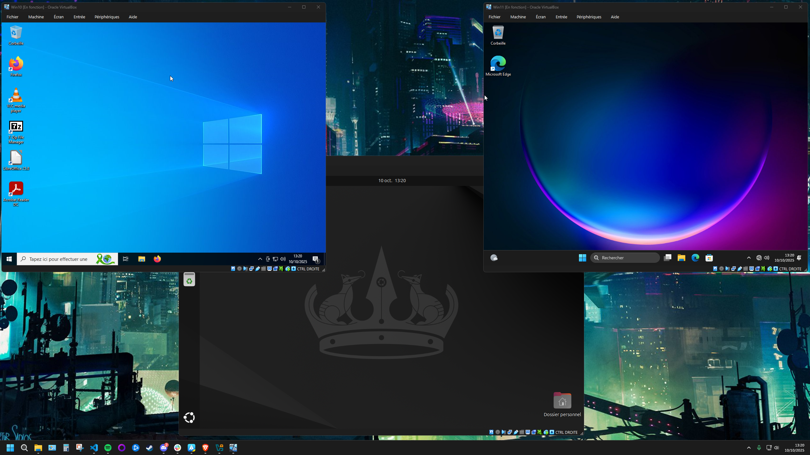
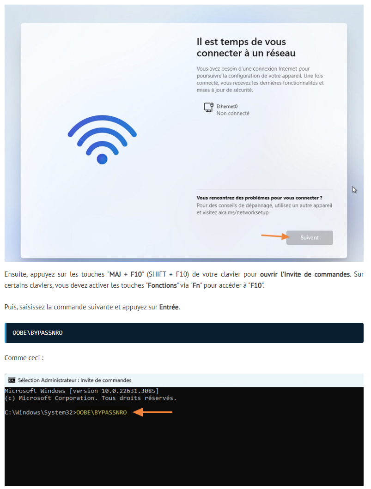

# Challenge 0105 10/10/2025

## Pitch de l’exercice

### S01 : Atelier découverte virtualisation

- Installez VirtualBox et configurez le BIOS
- Création de la VM windows 10
- Installez Mozilla Firefox, VLC, Adobe Reader, 7zip et LibreOffice.
- Créer un deuxième utilisateur n'ayant pas les droits Admin
- Bonus : Installez une seconde machine virtuelle, sur Windows 11 cette fois-ci !
- Bonus dans le bonus :  Trouvez comment installer Windows 11 sans devoir utiliser un compte Microsoft (en créant un utilisateur local, comme sur Windows 10 pro).
- Méga-bonus : Installez une troisième machine virtuelle, avec le système Ubuntu 24.04.

---

## Screen & Tips

- VM Windows 10 avec un user2 local

- VM Windows 11 sans compte Microsoft

- VM Ubuntu

- VirtualBox avec les 3 VM installées

- Les 3 VM lancées en simultané

Il y à eu plusieurs erreurs humaines et instabilités de Vbox me poussant à réinstaller plusieurs fois.

- Par exemple renommer une VM sur VirtualBox, ou oublier de retirer l'image disque d'installation.

- J'ai aussi revu les allocations de RAM et Coeurs car il y avait des Freeze en tentant de lancer/installer plusieurs VM à la fois. Win10 6144Mo et 4 coeurs, Win11 6144Mo et 4 coeurs, Ubuntu 4096mo et 4 coeurs.

Pour l'installation de Win11 sans compte Microsoft j'ai été dans les paramètres de la VM Win11 et désactivé la carte réseau. Puis effectué cette commande

