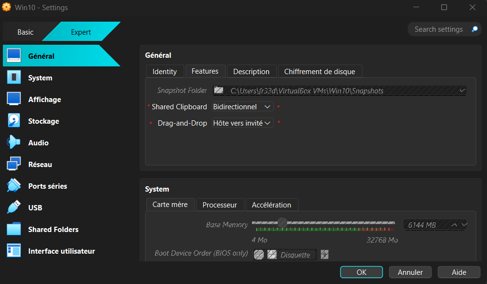
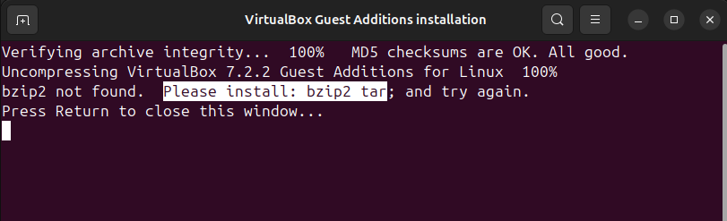
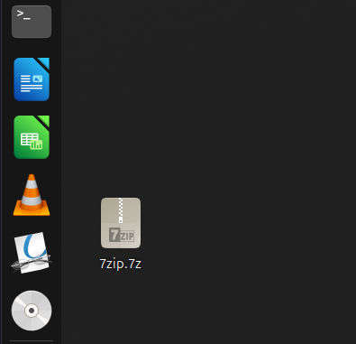
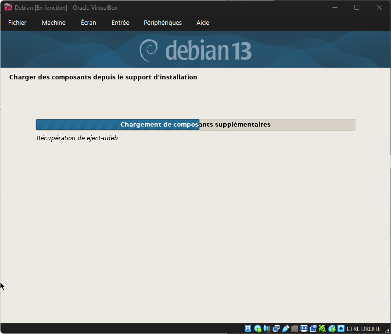
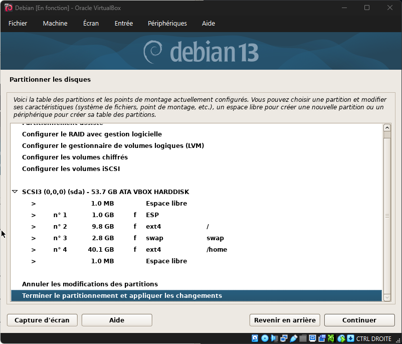
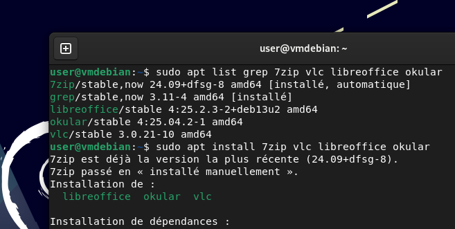
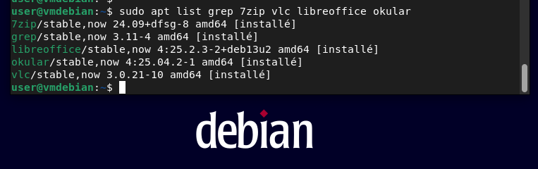

# Challenge 0106 13/10/2025

## Pitch de l’exercice 🧑‍🏫

- En priorité, terminez l’atelier de Vendredi ! (y compris les bonus, si possible)
- C’est à dire : installez Ubuntu et les logiciels demandés dessus !
- Activez le copier/coller entre vos VMs et votre système hôte (petit indice : il faudra regarder du coté des « Additions Invité » de Virtual Box 😉 une petite recherche sur Internet (ou avoir écouté votre super formateur) devrait vous permettre de trouver comment faire !)
- Bonus: Installer une 4ème VM avec le système d’exploitation Debian 13 !

---

## Virtual Box Guest Additions 💽

- Activation dans les paramètres du copier/coller et glisser/déposer sur les VM Windows 10 et 11 après avoir installé les Additions invités du Disque "VirtualBox Guest Additions". Elles permettent aussi de resize la fenêtre de la VM en fonction de l'hôte.

## Ubuntu 🐧

- J'ai voulu commencer par les Additions Invités mais au lancement du disque j'ai eu ce message d'erreur

- Correction de cette erreur avec cette commande pour réinstaller de force les outils manquants.

``sudo apt install --reinstall bzip2 tar``

- Installation du reste des applications à l'aide de commandes via le terminal pour la plupart.

- Installation d'Okular, un outil PDF qui remplace Adobe Acrobat sur Linux, même si à priori Libre Office Draw permet de faire les basiques.

## Debian 🐧

- Création de la VM à partir de l'image fournie ``debian-13.1.0-amd64-netinst.iso`` avec 4096Mo de Ram, 30Go d'espace disque et 2 CPU core.

- Partition Home séparée

- Installation de Vbox Guest Additions en chargeant l'image, lancement de l'executable, puis reboot et config, sans problème.

- Vérification et intallation des programmes mentionnés avec la commande ``sudo apt list grep 7zip vlc okular libreoffice``

- Installation des packages manquants

- Vérification

- C'est OOoookkkk

## Notes 🗒️

N'étant pas familier de linux j'ai voulu comprendre les commandes que j'utilise :

``sudo`` Super Utilisateur DO pour exécuter avec les droits admin

``apt`` Advanced Packaging Tool pour gérer les paquets (update install remove)

``tar`` Tape ARchiver, utilitaire pour regrouper des fichiers

``bzip2`` algo de compression

``grep`` g/re/p : globally search for a regular expression and print, est un outil de Linux pour faire des recherches spécifiques.
