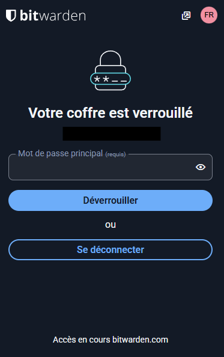
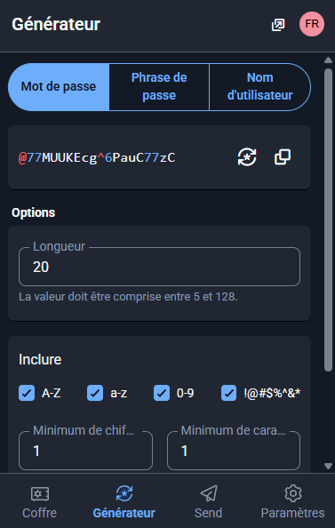
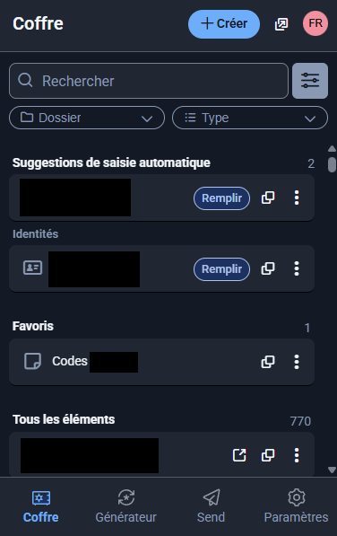

# Challenge 0107 14/10/2025

## Pitch de l’exercice 🧑‍🏫

Après ce qu’on a vu aujourd’hui, est-ce qu’il serait pas intéressant de changer certaines de vos pratiques ?
La première chose à faire : sécuriser vos mots de passe !

Au programme de ce challenge : installez et configurez un gestionnaire de mot de passe ! Nous vous recommandons Bitwarden, qui est gratuit pour un usage personnel et open-source (on reparlera de ce que ça implique plus tard mais vous avez de toute évidence déjà été un peu spoil).

---

## Bitwarden 🔐

### Comment installer et configurer Bitwarden ? 💾

- L'installation de Bitwarden est très simple et se fait en quelques étapes. L'idée est d'avoir une application centrale (un "coffre-fort") et des extensions pour les navigateurs ou l'app sur smartphone pour de l'utiliser facilement au quotidien.

- Créer un compte : On va sur le site officiel de Bitwarden et on se crée un compte, puis on doit définir un mot de passe maître. C'est LE mot de passe le plus important, le seul à retenir. Il doit être long, complexe et unique !

- Installer l'application : Ajouter l'extension aux navigateurs web permet de sauvegarder automatiquement les nouveaux mots de passe et de pré-remplir les champs sur les sites web. Télécharger et installer l'application Bitwarden sur smartphone. Cela permet de gérer les mots de passe de manière centralisée.

- Configuration de base : on se connecte à l'application et à l'extension avec le mot de passe maître. On peut ensuite commencer à ajouter manuellement les mots de passe existants ou le faire au fur et à mesure qu'on se connecte à nos différents comptes en ligne. On peut aussi les importer / exporter. Il est fortement conseillé d'ajouter une identification 2FA.

### Les avantages d'un gestionnaire de mots de passe 📟

- Un seul mot de passe à retenir : Fini les post-its ou l'utilisation du même mot de passe partout, il suffit de mémoriser un seul mot de passe maître. Le gestionnaire s'occupe de tous les autres.

- Des mots de passe forts et uniques : Le gestionnaire peut générer des mots de passe extrêmement complexes (par exemple ``5?Trp@8!z$qE*wK#_2``) et uniques pour chaque site. Il peut aussi gérer les autentifications 2 facteurs et les clés de connexion.

- Sécurité renforcée : Les mots de passe sont stockés dans un coffre-fort numérique chiffré. Même si quelqu'un accédait aux serveurs de Bitwarden, il ne pourrait pas lire les mots de passe sans notre mot de passe maître.

- Gain de temps et confort : Plus besoin de chercher ou de taper nos mots de passe. Bitwarden rempli automatiquement les formulaires de connexion en un clic. Il peut aussi stocker des informations de cartes bancaires ou des adresses pour remplir rapidement les formulaires de paiement.

- Accessibilité multi-plateformes : Les mots de passe sont synchronisés sur tous les appareils (ordinateur, téléphone, tablette).

En résumé, un gestionnaire de mots de passe est un outil essentiel aujourd'hui pour allier haute sécurité et simplicité d'utilisation.👍
