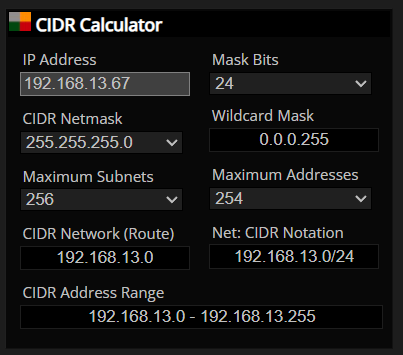

# Challenge 0109 16/10/2025

## Pitch de l’exercice 🧑‍🏫

Au programme ce soir, un peu de maths 😱

Pour les adresses IP et masques de sous-réseau suivants, calculez :

- l’adresse de réseau

- l’adresse de broadcast

- le nombre d’adresses utilisables par des machines

- la plage d’adresses disponibles

Certains utilisent la notation « classique », d’autres la notation CIDR :

``192.168.13.67/24``

``172.16.0.1 – 255.255.255.0``

``172.16.27.32/23``

``10.7.5.1 – 255.255.128.0``

``10.42.0.82/12``

Essayez de calculer tout à la main (avec la méthode de votre choix, idéalement essayez d’utiliser les deux !), puis vérifiez vos calculs avec une calculatrice en ligne ([exemple](https://www.subnet-calculator.com/cidr.php)) !

## Place aux Maths 🧠🧮

### - ``192.168.13.67/24``

/24 signifie qu'on a 24 "1" dans le sous-masque réseau, ou 24/8 = 3 octets, traduit en binaire :

1111 1111 . 1111 1111 . 1111 1111 . 0000 0000 qui correspond à **255.255.255.0** en décimal.

- **[Utilisons la méthode logique](../images/Logique.jpg)**

(adresse IP) ET (masque)=adresse réseau

(NOT masque) OU (adresse réseau)=adresse broadcast

- **Calcul de l'adresse réseau**

IP : 192.168.13.67 on commence par traduire cette IP en binaire, on va utiliser la table de calcul à partir des multiples de 2.

|Table 2²| 128 | 64 | 32 | 16 | 8 | 4 | 2 | 1 |
|---|---|----|----|----|----|----|----|-----|
|192| 1 | 1 | 0 | 0 | 0 | 0 | 0 | 0 |
| 168 | 1 | 0 | 1 | 0 | 1 | 0 | 0 | 0 |
| 13 | 0 | 0 | 0 | 0 | 1 | 1 | 0 | 1 |
| 67 | 0 | 1 | 0 | 0 | 0 | 0 | 1 | 1 |

IP en binaire : 1100 0000 . 1010 1000 . 0000 1101 . 0100 0011

Subnet binaire : 1111 1111 . 1111 1111 . 1111 1111 . 0000 0000

ET Logique : 1100 0000 . 1010 1000 . 0000 1101 . 0000 0000

**Adresse réseau : 192.168.13.0**

- **Calcul de l'adresse de broadcast**

NOT Subnet binaire : 0000 0000 . 0000 0000 . 0000 0000 . 1111 1111

Adresse réseau : 1100 0000 . 1010 1000 . 0000 1101 . 0000 0000

Adresse broadcast : 1100 0000 . 1010 1000 . 0000 1101 . 1111 1111

**Adresse broadcast : 192.168.13.255**

- **Calcul du nombre d'adresses utilisables pour les machines**

On est en /24 soit 3 octets réservés au réseau, il reste donc un seul octet pour les hôtes : 8 bits. Néanmoins 2 adresses sont réservées, l'adresse réseau et l'adresse de diffusion (broadcast) ne sont pas utilisables par les machines.

Formule de calcul des hôtes possible : ``(2^b)-2``, ici (2^8)-2 = **254**

- **Calcul de la plage d'adresses disponibles**

On va faire le même calcul mais cette fois on inclu toutes les adresses.

Formule de calcul de la plage d'adresses disponibles : ``(2^b)``, ici (2^8) = **256**

- **Résultats**

``192.168.13.67/24``

Sous-masque : 255.255.255.0

Adresse réseau : 192.168.13.0

Adresse broadcast : 192.168.13.255

Machines hôtes : 254

Plage d'adresses : 256, 192.168.13.0 à 192.168.13.255

---

### - ``172.16.0.1 – 255.255.255.0``

J'utiliserais la [méthode du "Nombre magique"](https://zestedesavoir.com/tutoriels/321/calculer-une-plage-dadresses-avec-la-methode-magique/#2-10258_quest-ce-que-la-methode-magique) à partir de maintenant qui est plus rapide et surtout peut se calculer de tête et sans papier.

- **Calcul de l'adresse réseau**

Le sous-masque étant 255.255.255.0, l'octet significatif est donc le dernier octet

256-0 = 256, les multiples de 256 sont 0, 256, 512...

0 est le multiple inférieur/égal à 1 (dernier octet de l'adresse IP)

L'adresse réseau est donc **172.16.0.0**

- **Calcul de l'adresse de broadcast**

On prend le multiple suivant, donc 256, -1

L'adresse broadcast est donc **172.16.0.255**

- **Calcul du nombre d'adresses utilisables pour les machines**

Le sous-masque étant 255.255.255.0, il y a seulement un octet libre, soit (2^8)-2 = **254**

- **Calcul de la plage d'adresses disponibles**

Idem sans enlever les 2 adresses, soit (2^8) = **256**

- **Résultats**

``172.16.0.1 – 255.255.255.0``

Sous-masque : 255.255.255.0

Adresse réseau : 172.16.0.0

Adresse broadcast : 172.16.0.255

Machines hôtes : 254

Plage d'adresses : 256, 172.16.0.0 à 172.16.0.255

On peut aussi l'écrire : 172.16.0.1/24

---

### - ``172.16.27.32/23``

- **Calcul de l'adresse réseau**

Le sous-masque en /23 se traduit par 23 "1" puis 9 "0" en binaire :

1111 1111 . 1111 1111 . 1111 1110 . 0000 0000 soit 255.255.254.0 et l'octet significatif est le 3ieme.

256-254 = 2, les multiples sont 0 2 4 6 8 10 ... 24 26 28 30 ...

26 est le multiple inférieur/égal à 27 (3ieme octet de l'adresse IP), et le dernier octet sera 0.

L'adresse réseau est donc **172.16.26.0**

- **Calcul de l'adresse de broadcast**

On prend le multiple suivant, donc 28, -1

L'adresse broadcast est donc **172.16.27.255**

- **Calcul du nombre d'adresses utilisables pour les machines**

Le sous-masque étant /23 il reste (32-23) = 9 bits libres, soit (2^9)-2 = **510**

- **Calcul de la plage d'adresses disponibles**

Idem sans enlever les 2 adresses, soit (2^9) = **512**

### **Résultats**

``172.16.27.32/23``

Sous-masque : 255.255.254.0

Adresse réseau : 172.16.26.0

Adresse broadcast : 172.16.27.255

Machines hôtes : 510

Plage d'adresses : 512, 172.16.26.0 à 172.16.27.255

---

### - ``10.7.5.1 – 255.255.128.0``

- **Calcul de l'adresse réseau**

- **Calcul de l'adresse de broadcast**

- **Calcul du nombre d'adresses utilisables pour les machines**

- **Calcul de la plage d'adresses disponibles**

### **Résultats**

``192.168.13.67/24``

Sous-masque : 255.255.255.0
Adresse réseau : 192.168.13.0
Adresse broadcast : 192.168.13.255
Machines hôtes : 254
Plage d'adresses : 256, 192.168.13.0 à 192.168.13.255

---

### - ``10.42.0.82/12``

- **Calcul de l'adresse réseau**

- **Calcul de l'adresse de broadcast**

- **Calcul du nombre d'adresses utilisables pour les machines**

- **Calcul de la plage d'adresses disponibles**

### **Résultats**

``192.168.13.67/24``

Masque : 255.255.255.0
Adresse réseau : 192.168.13.0
Adresse broadcast : 192.168.13.255
Machines hôtes : 254
Plage d'adresses : 256, 192.168.13.0 à 192.168.13.255

---

### - CIDR Calculator 🔣

Merci la technologie, plus besoin de se faire des noeuds au cerveau !

