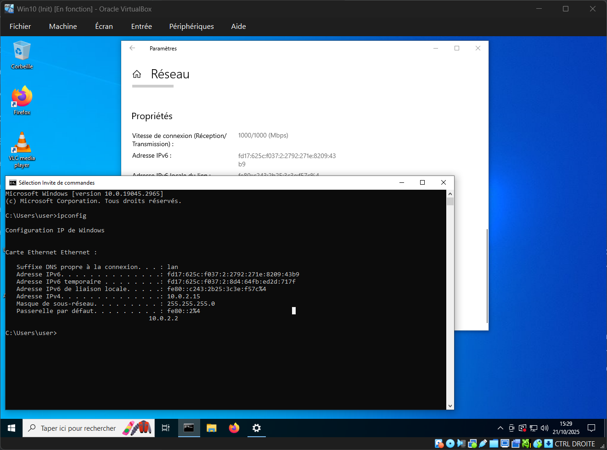
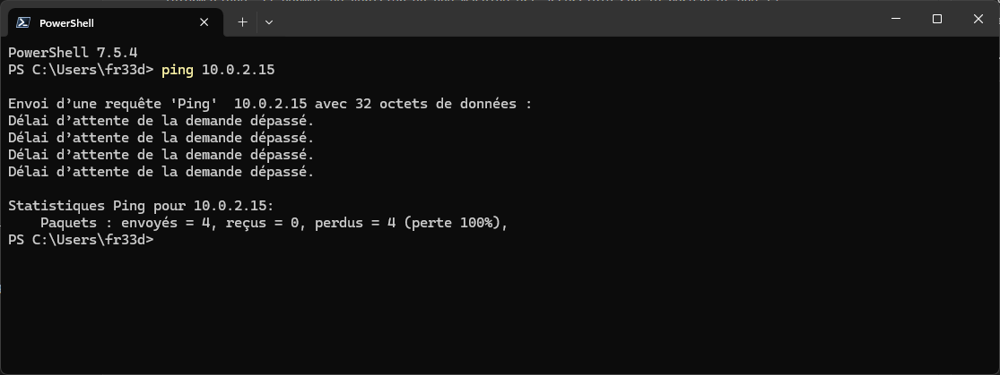
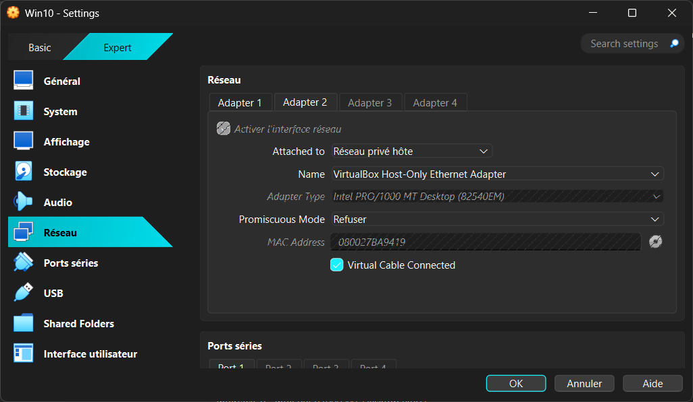
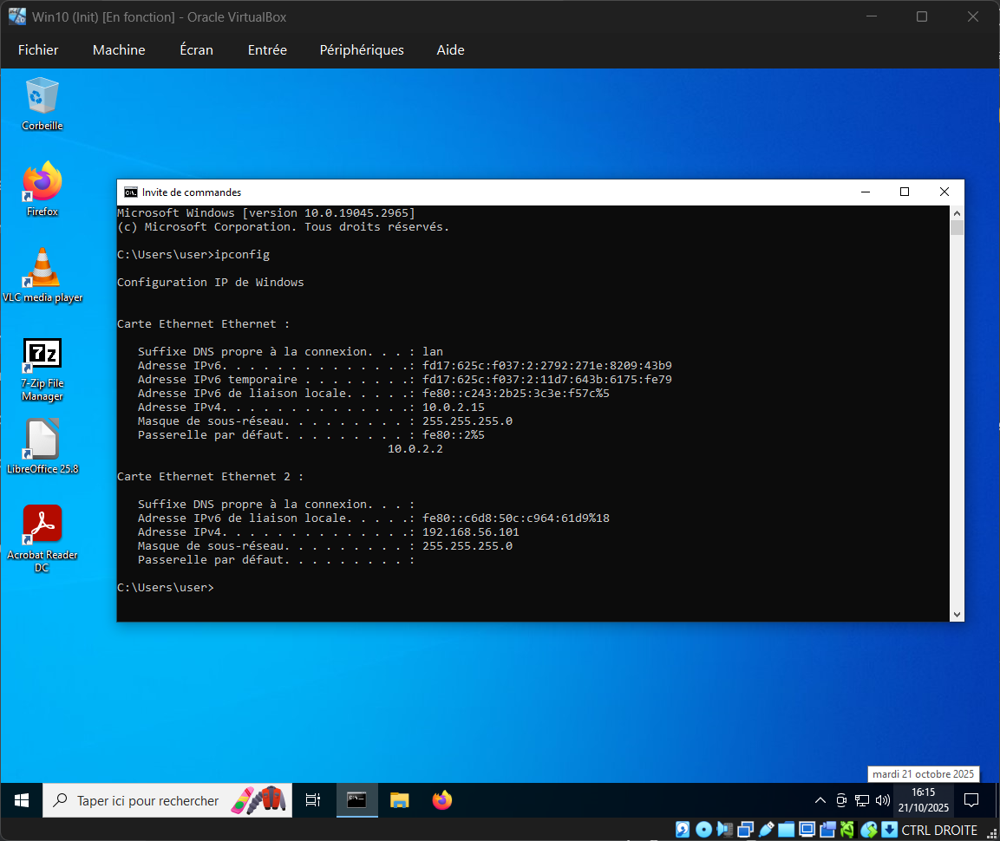
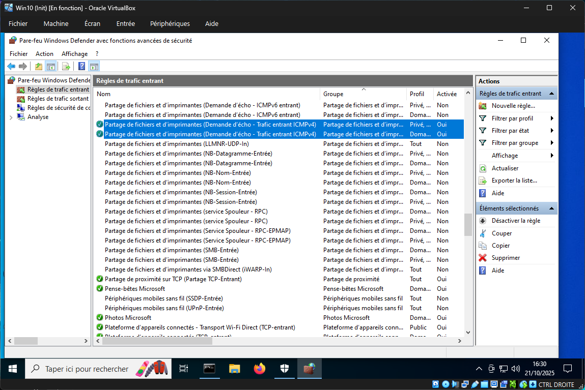
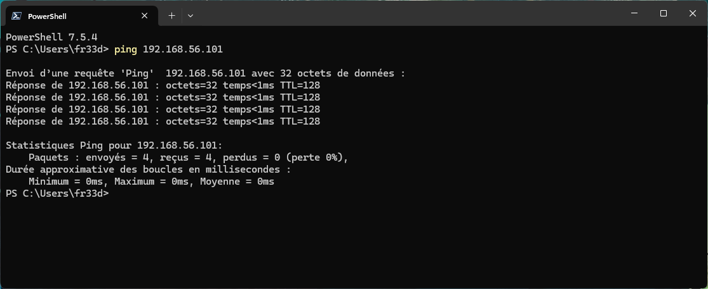
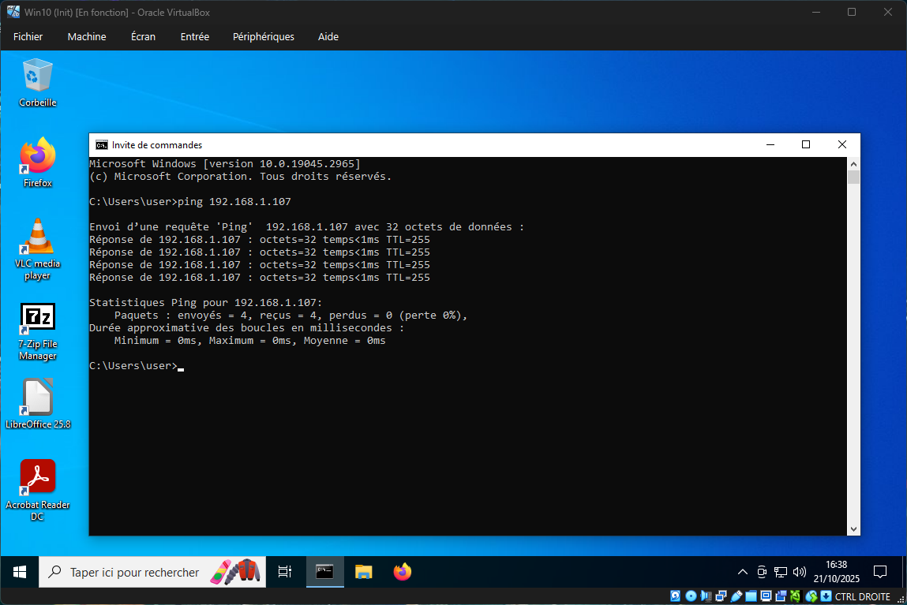

# Challenge 0202 21/10/2025

## Pitch de l’exercice 🧑‍🏫

⌨️ Challenge

Actuellement, sur Windows 10 et Windows 11, il est impossible de pinguer vos machines virtuelles (VM) depuis votre ordinateur hôte (votre PC personnel) sous VirtualBox.

- Votre tâche consiste à permettre à votre machine hôte d’effectuer un ping vers vos VM Windows.
En d’autres termes, vous devez configurer votre environnement de manière à rendre vos VM accessibles en réseau depuis votre poste principal.

💡 Rappel :

Le ping est un test de connectivité réseau.

C’est l’un des tests les plus simples, mais aussi l’un des plus importants à maîtriser en informatique. Il permet de vérifier qu’une machine est accessible sur le réseau et que la communication est possible entre deux hôtes.

## Test de connectivité réseau 🖥️🔄🖥️

- Premier Test Ping

Pour ce test je vais chercher l'adresse IP de ma VM (ici la Win10), soit depuis le terminal en tapant ``ipconfig``, soit dans les paramètres réseaux.

Le ping échoue.

VirtualBox fonctionnant en mode NAT (Network Address Translation), il donne juste accès à Internet aux machines virtuelles via un réseau privé isolé, mais elles ne sont pas sur mon réseau local physique.

Il y a deux solutions pour permettre aux VM et à l'hôte de communiquer :

- Réseau privé Hôte (Host-only Adapter) 🔗

- Accès par pont (Bridge) 🌉

## Réseau privé Hôte (Host-only Adapter) 🔗

Cette solution va permettre de créer un réseau privé et isolé dans lequel il n'y aura que le PC hôte et les VMs. Pour garder la connexion à Internet on va garder l'interface réseau NAT, et on va ajouter une interface Host-Only puis démarrer la VM.

On récupère sa nouvelle adresse IP ``192.168.56.101``

Après un nouveau ping ne fonctionnant pas, j'ai cherché d'ou ça venait et il s'avère que le Firewall Windows peu bloquer la demande de ping. J'ai donc été activer les règles de traffic entrant (et sortant pour le faire dans l'autre sens) concernant le ping (Demande d'écho). Traffic entrant/sortant ICMPv4.

Une fois ces changement effectués, j'ai pu ping la VM depuis l'hôte et l'hôte depuis la VM.

## Accès par pont (Bridge) 🌉
