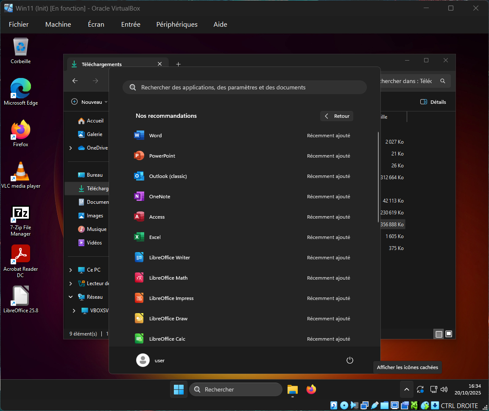
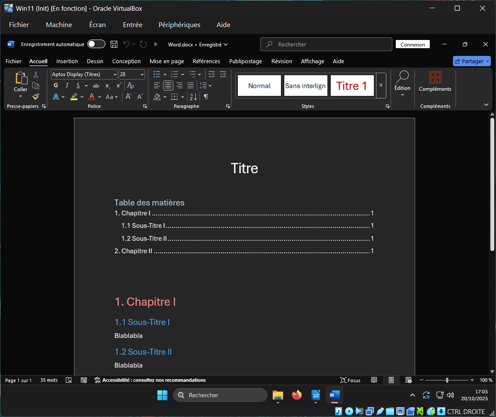
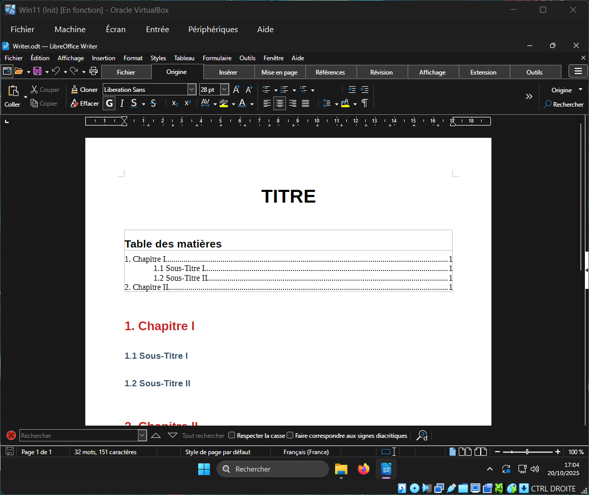
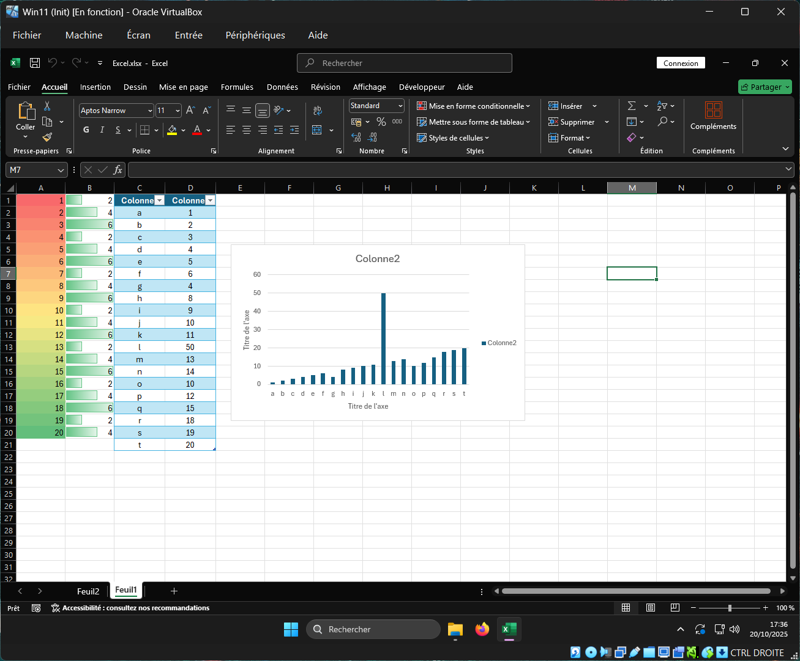
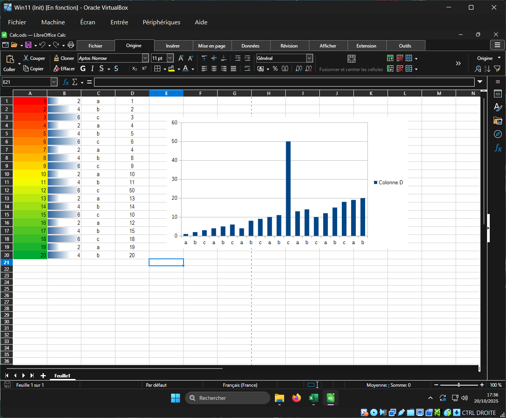
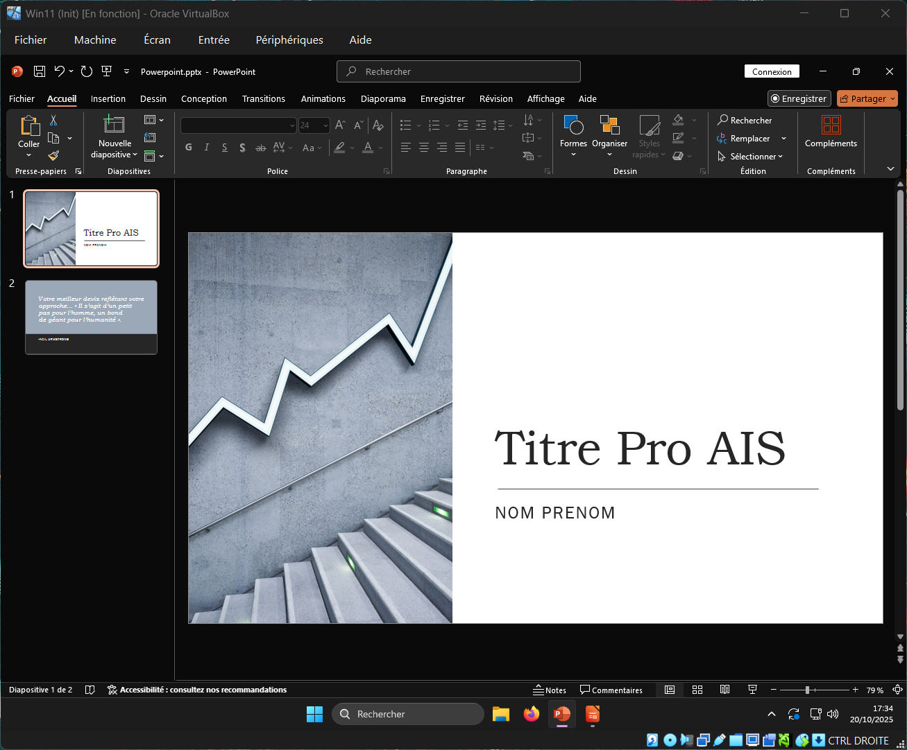
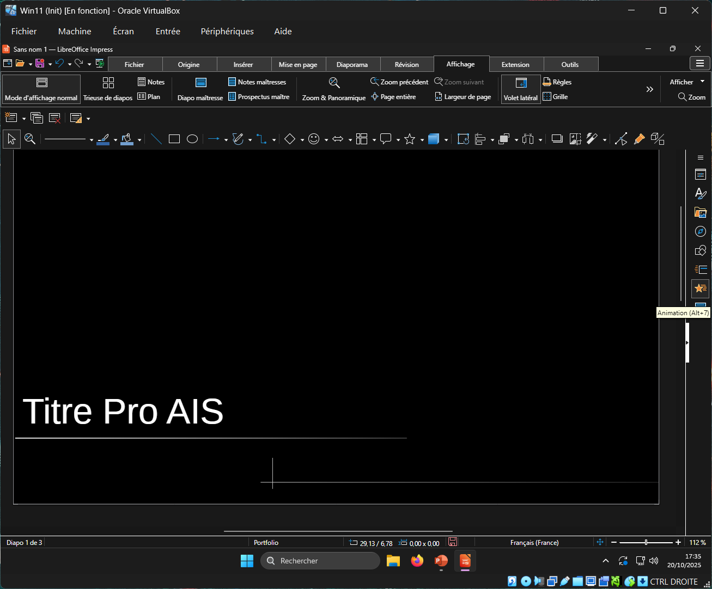
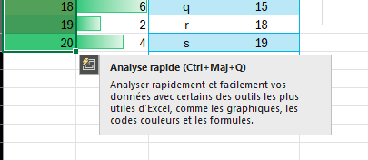
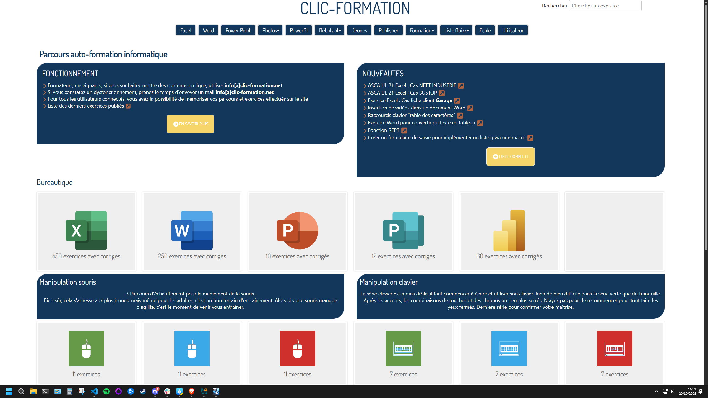

# Challenge A201 20/10/2025

## Pitch de l’exercice 🧑‍🏫

⌨️ Challenge

- Installer et configurer Microsoft Office et LibreOffice sur votre machine ou sur une machine virtuelle ! (Office est dispo sur le drive).

- Créer un document, un tableur, et une présentation avec l’une des suites.

- Tester la compatibilité des fichiers en ouvrant un fichier créé dans Microsoft Office avec LibreOffice et inversement.

- Explorer les options de collaboration en ligne avec Microsoft Office (Office 365) ou LibreOffice (Collabora)

- Explorer le site <https://www.clic-formation.net/>

[Cours A201.](/RESUME.md#-a201-outils-bureautiques)

---

## Installation de MicrosoftOffice et LibreOffice 🖥️

J'ai installé MSofficeProPlus2024Retail et LibreOffice_25.8.2_Win_x86-64 sur une VM Windows 11.

## Création d'un doc, un tableur et une prés avec l'une des suites 📝

Doc Word

Doc Writer

Doc Excel

Doc Calc

Doc Powerpoint

Doc Impress

Ce n'est qu'un avis personnel peut être biaisé par une méconnaissance de LibreOffice mais je trouve plus facile la prise en main de Microsoft Office, notament l'aide au niveau de la selection qui s'adapte à ce que l'on peut avoir besoin. Ainsi que la barre de recherche de fonctions tout en haut. Pour Impress je n'ai pas du tout été Impress'ionné, même pire j'ai détesté.

## Test de Compatibilité entre les deux suites 🔁

- Word & Writer : pas de problème particulier au niveau de la compatibilité pour ouvrir le fichier Writer.odt avec Word ou pour ouvrir le fichier Word.docx avec Writer. On perd néammoins les fonctions comme la mise à jour de la table des matières. Word conserve l'arborescence clicable des Titres, alors que Writer non. On doit changer de format de fichier pour tout garder lors des sauvegardes.

- Excel & Calc : là encore pas de soucis de compatibilité, on peut ouvrir l'un et l'autre directement. On notera encore des petits problèmes au niveau de certaines choses comme les mise en forme conditionnelles, Excel n'a pas pris en compte celles du fichier .ods alors que Calc à gardé celles du .xlsx

- Powerpoint & Impress : là encore pas de soucis de compatibilité, on peut ouvrir l'un et l'autre directement. Je n'avais pas créé de présentation bien compliquée, par contre powerpoint à mis une police noire alors qu'elle étant blanche sur Impress.

## Collaboration en ligne avec ces suites 📶

N'ayant personne avec qui tester ces options en profondeur, et Collabora n'étant pas gratuit je me suis surtout renseigné sur internet. Pour la suite Libreoffice de base, il y a peu d'options de partage et de collaboration, alors que sur MicrosoftOffice on peut facilement partager et travailler à plusieurs via un compte miscrosoft et OneDrive.

Pour faciliter le travail en équipe on va s'orienter vers Microsoft365 et Collabora Online qui sont des suites de collaboration en ligne et en simultané.

Collabora Online est une suite buteautique en ligne, open source et s'appuyant sur Libreoffice, permettant une édition collaborative en temps réel du même type de documents que Libreoffice.

Chez Microsoft, la co-édition a été mise en avant dans Miscrosoft365. C'est une solution solide et clef-en-main, mais pas open source.

Collabora est une bonne option si on veux héberger sois-même la solution et garder le sontrôle des données.

Microsoft365 reste la solution de facilité, les intégrations cloud sont natives.

## Découverte du site <www.clic-formation.net> 👀

Clic-formation.net est une plateforme de formation en ligne dédiée à l'acquisition de compétences, du débutant au plus expérimentés. Il permet au débutant de se former sur les toutes bases comme l'utilisation du clavier et souris, avec de nombreux exercices. Mais aussi sur les suites de bureautique de Microsoft et LibreOffice, ainsi que Publisher/Scrubitus, PowerBI, Photofiltre, Inskape, avec une multitudes d'exercices pour s'entrainer.

