# Challenge A203 22/10/2025

## Pitch de l’exercice 🧑‍🏫

⌨️ Challenge

- Essayez l’outil MemTest86 sur votre PC 🧠

Il vous faudra pour cela une clé USB, sauvegardez tout ce que vous avez dessus avant de suivre les instructions ci-dessous ! ⚠️

Téléchargez MemTest86 Free depuis le site officiel.

Trouvez le moyen de « l’installer » sur votre clé USB, en suivant les instructions officielles ou en cherchant un peu sur Internet ! (attention à ne pas effacer votre disque dur malencontreusement !)

Redémarrez votre PC et bootez sur MemTest !

Lancez un test complet de votre RAM.

💡 Si vous ne voulez pas prendre de risque, vous pouvez aussi tenter de lancer MemTest86 sur une machine virtuelle. À vous de trouver comment faire 😉

- 🏆 Challenge Bonus

Rendez-vous avec des outils de prise en main à distance, que ce soit AnyDesk, TeamViewer, ou même les outils natifs de votre système d’exploitation.

L’objectif est simplement d’explorer leurs possibilités et de tester par vous-même différents outils.

[Cours A203.](/RESUME.md#-a203-contrôle-à-distance)

---

## MemTest86 🧠

### Créer une clef USB de Boot

Téléchargement de l'exécutable sur le site officiel.

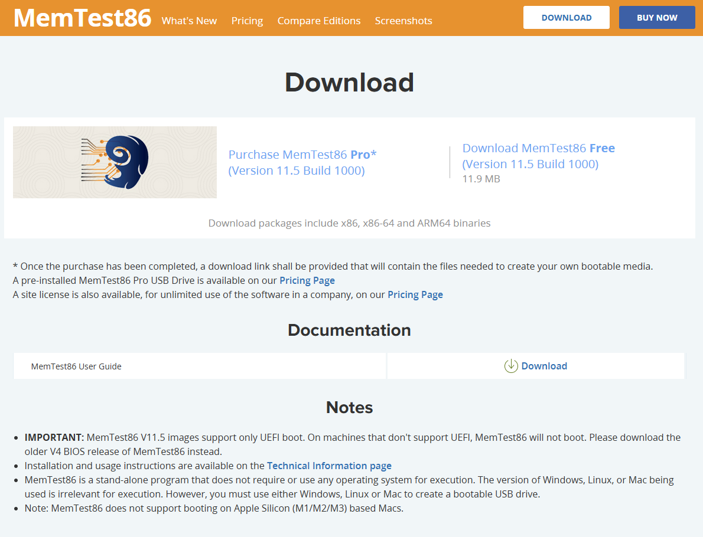

Setup le support USB en suivant le User Guide officiel :

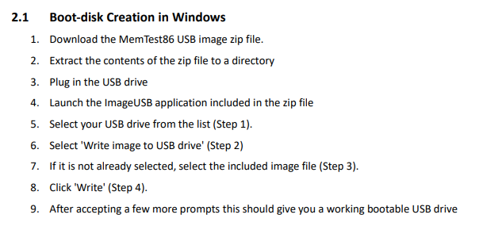

Pour résumer l'exécutable reformate la clef USB, la transformant en clef bootable.

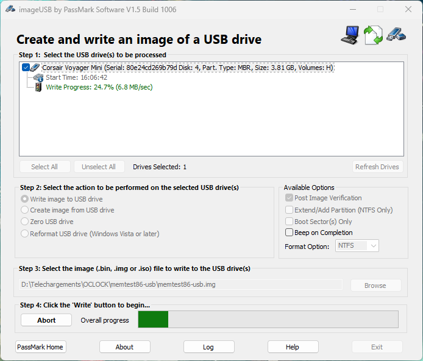

Par la suite il faut reboot le PC, si le boot sur support n'est pas activé il faut entrer dans le BIOS pour activer les périphériques USB et éventuellement le placer en 1ier dans l'odre de Boot.

Sachant que le memorytest peut prendre très longtemps je ne l'ai pas effectué et j'ai décidé de le faire sur une VM vu la mémoire limité, et me permettant de faire autre chose pendant ce temps.

### Memtest86 sur une VM

Pour le faire sur une VM, il faut télécharger le fichier ISO de l'exécutable, le mettre en tant que CD/DVD de boot, donc ajouter le fichier image dans les périphériques de stockage.

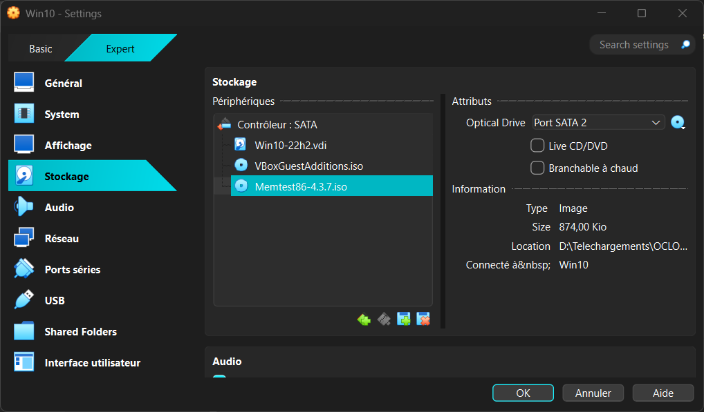

Lors du lancement de la VM on boot bien sur Memtest86 et on lance le test de mémoire.

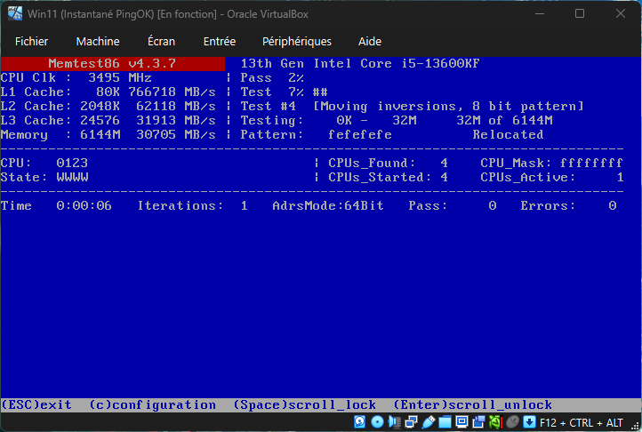

Après presque 20min, au 8ième test, toujours pas d'erreurs détectées.

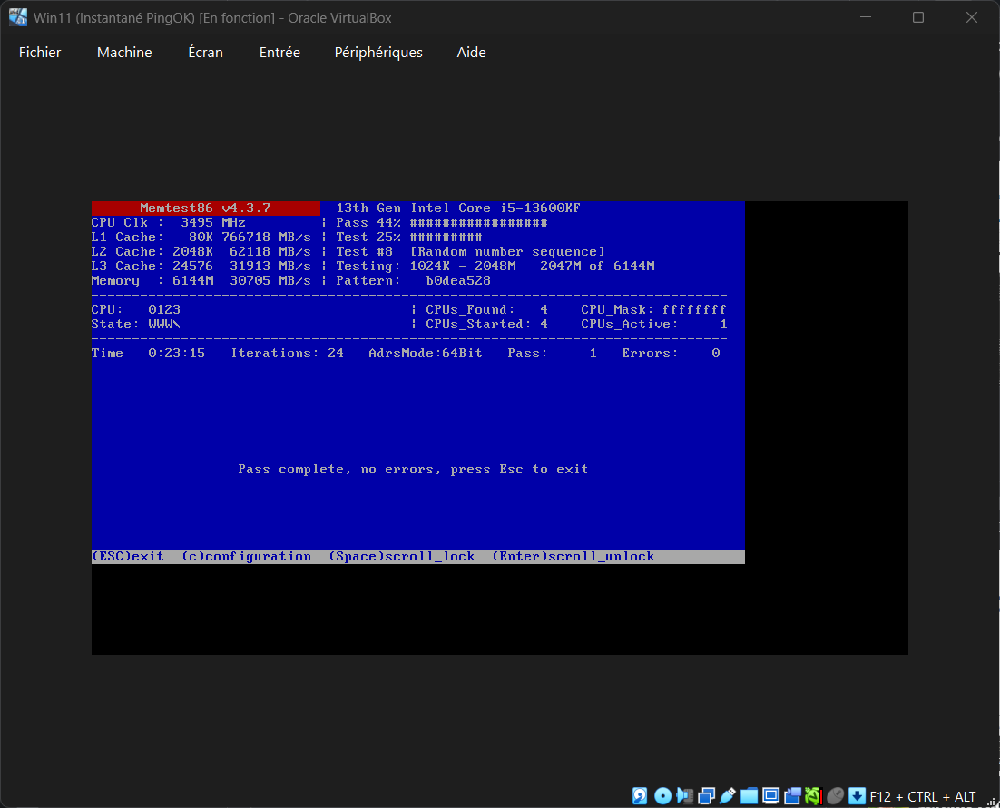

Lu sur internet : *MemTest86 peut prendre beaucoup de temps en raison de la nature exhaustive de ses tests, qui sont conçus pour détecter des erreurs subtiles dans la mémoire vive. Le nombre d'itérations nécessaires dépend de plusieurs facteurs, notamment la quantité de RAM installée, la profondeur des tests et le niveau de confiance souhaité dans les résultats.
 Les tests sont exécutés en boucle infinie, ce qui signifie qu'il n'y a pas de limite fixe à la durée d'exécution. La durée est influencée par la complexité des algorithmes utilisés. Par exemple, le test 7, qui utilise un motif de 32 bits et est particulièrement efficace pour détecter des erreurs liées aux données, nécessite jusqu'à 32 passes pour couvrir toutes les combinaisons possibles, ce qui explique une durée de test prolongée.
 En pratique, même si un test peut passer sans erreur après une seule passe, il est recommandé de le laisser tourner pendant plusieurs heures ou une journée entière pour être sûr à 100 % que la mémoire est fonctionnelle.
 Cela est particulièrement important car certaines erreurs ne se manifestent qu'après plusieurs heures de fonctionnement, par exemple en raison de la chaleur ou de la dégradation progressive des composants.
 Il est également à noter que MemTest86 ne peut prouver l'absence de problèmes, seulement leur présence.  Même après des dizaines d'heures de test, une erreur pourrait apparaître ultérieurement. Par conséquent, la durée du test dépend de la tolérance au risque de votre système : pour une utilisation critique, une exécution prolongée est préférable.*

## Bonus : Le controle à distance 🖥️🔁🖥️

J'installe Anydesk et Teamviewer sur mes 2 VM Windows 10 et 11.

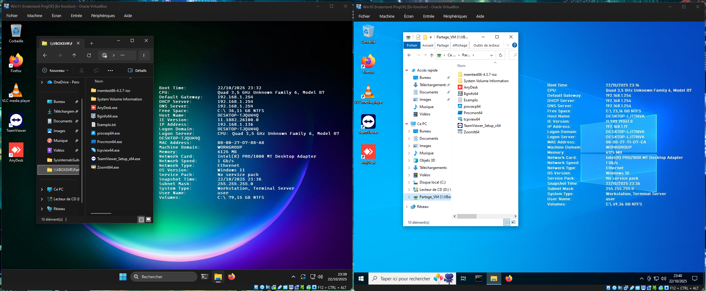

### avec Anydesk

En lançant Anydesk sur les 2 machines qui ont la découverte réseau, elles se détectent immédiatement l'une - l'autre.

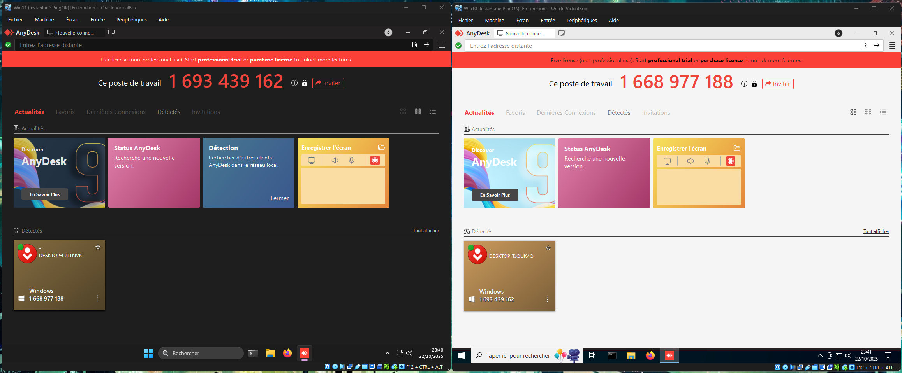

En me connectant de l'une à l'autre, la machine qui reçoit la demande doit accepter, il y a plusieurs choix avec des niveaux de sécurité différents, du simple partage d'écran, à la prise en main avec tous les droits.

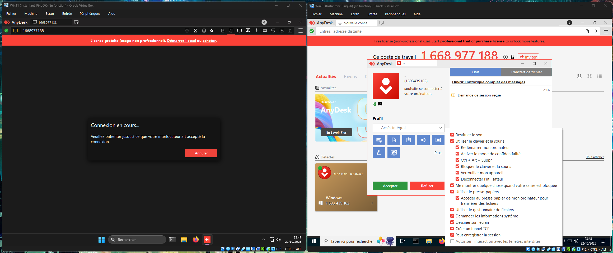

J'ai pu ainsi entrer dans les règles de pare-feu, si l'utilisateur avait un problème pour trouver une imprimante réseau par exemple, lancer le terminal, etc.

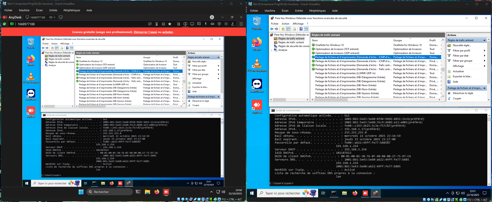

Depuis la machine qui fait la demande, nous avons pas mal d'options, se conencter à plusieurs machines, voir les informations détaillées de la machine cible, faire des actions spécifiques ou transférer des fichiers.

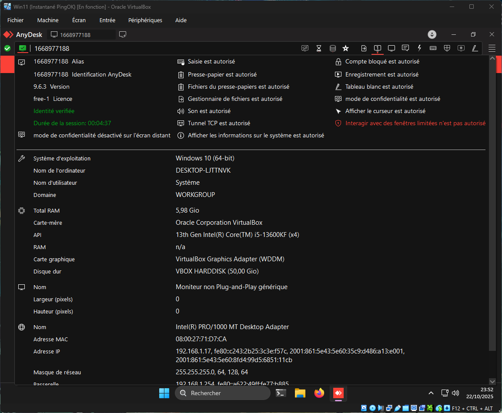

On peut même envoyer un message écrit qui restera affiché une fois déconnecté.

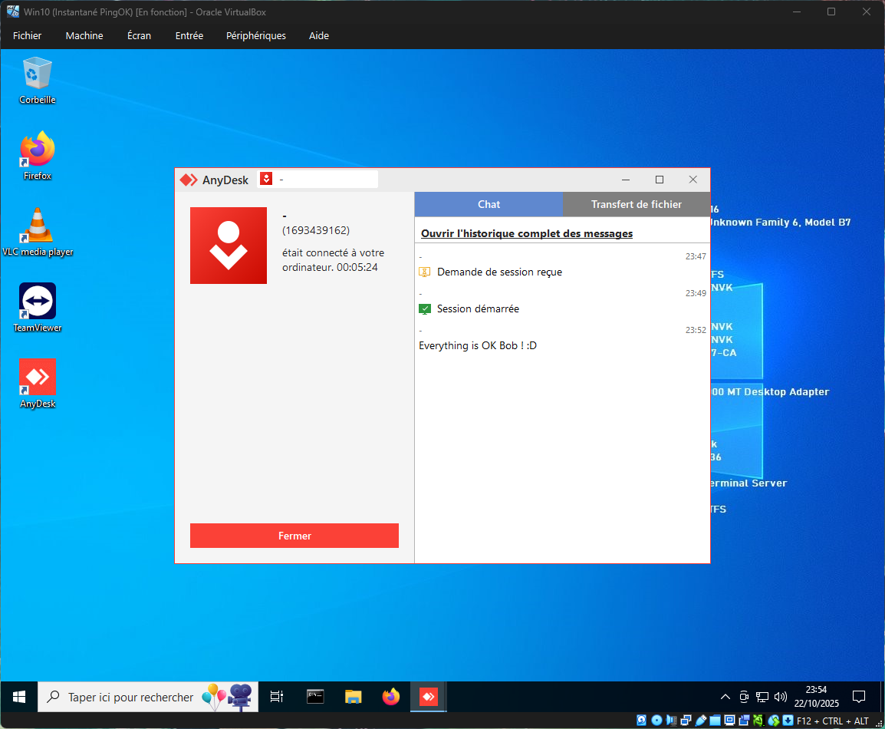

L'incident de Bob est résolu ^^

### avec Teamviewer

En lançant Teamviewer sur les 2 machines elles ne se détectent pas comme Anydesk, de plus il faut créer un compte Teamviewer vérifié pour pouvoir prendre le contrôle à distance. J'ai créé un compte que j'utiliserais sur la machine de gauche (Win11) pour prendre le contrôle de la machine de droite (Win10).

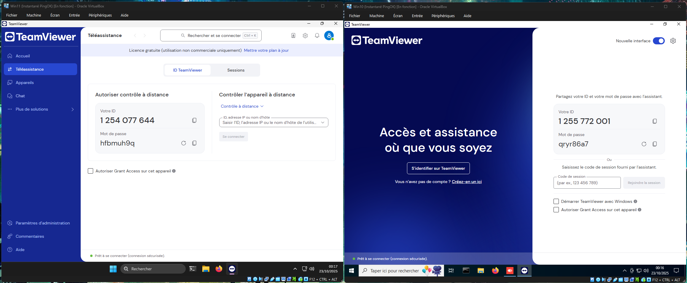

En me connectant de l'une à l'autre, il faut entrer le mot de passe puis on est connectés. J'ai pu ainsi entrer dans les règles de pare-feu, si l'utilisateur avait un problème pour trouver une imprimante réseau par exemple (encore oui!), lancer le terminal, etc.

Quelques différences avec Anydesk : la connexion par mot de passe, on ne garde pas le fond d'écran, la machine cible voit un encadré orange et peut cloturer la connexion directement, elle voit également qui est connecté en bas à droite.

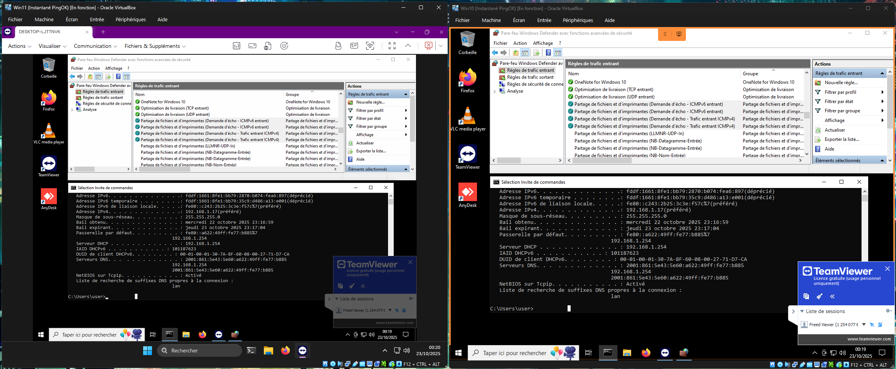

Depuis la machine qui fait la demande, nous avons là aussi des options, mais elles fonctionent moins bien et sont moins complètes que ANydesk à première vue, les informations détaillées de la machine cible de sont pas apparu après plusieurs minutes d'attente, on peut quand même faire des actions spécifiques ou transférer des fichiers. Il y a en plus un "tableau blanc" pour dessiner ou écrire.

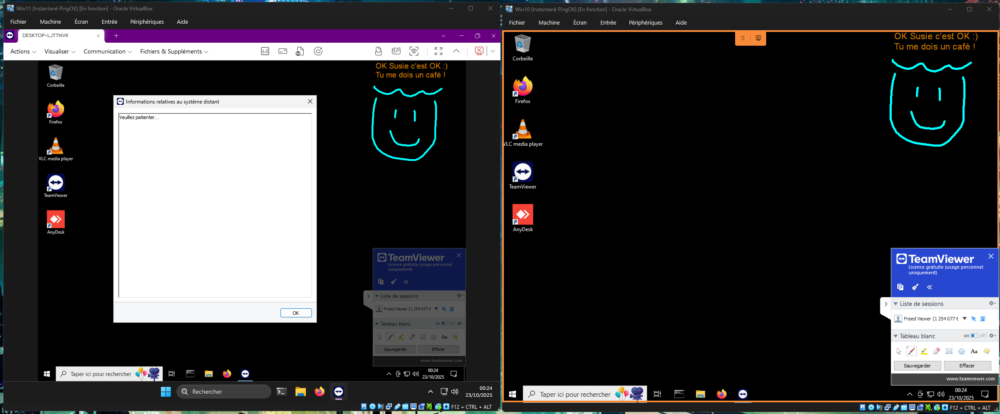

Une fois déconnecté, TEamviewer à fermé la session pour la machine cible qui n'a pas pu garder mon message, mais c'est peut être lié à la version gratuite.

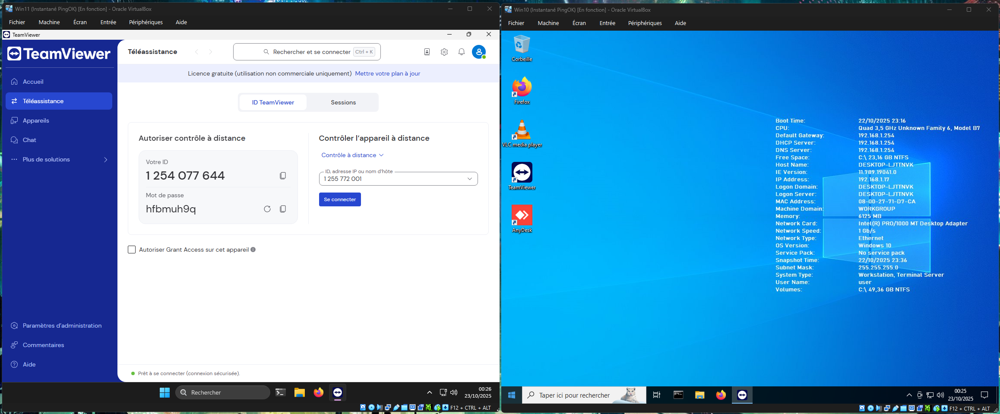

L'incident de Susie est aussi résolu ^^

### Mon retour personnel

En premier lieu j'ai trouvé l'interface d'Anydesk pas du tout à mon gout comparé à Teamviewer, et pourtant après avoir utilisé les deux, j'ai trouvé Anydesk plus facile à prendre en main, plus intuitif, et en apparence moins limité (par la licence gratuite).
