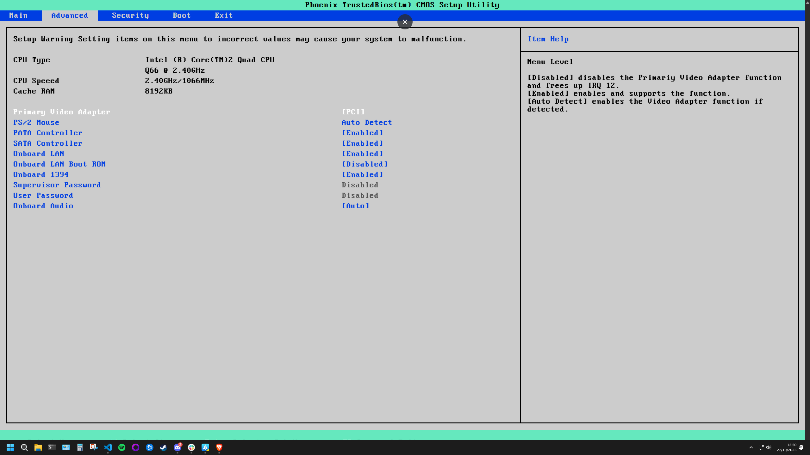
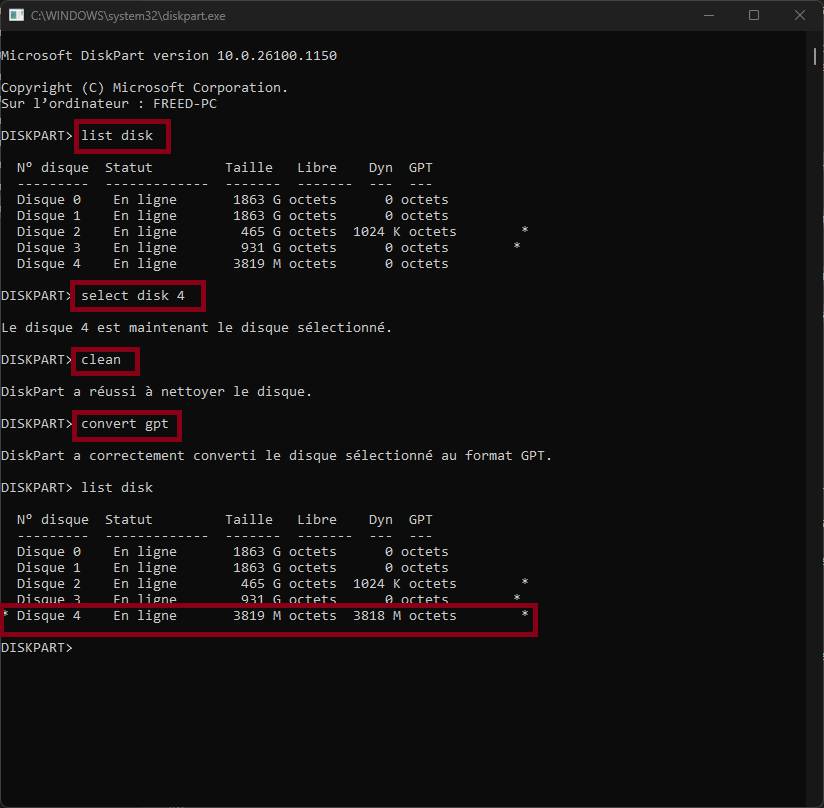
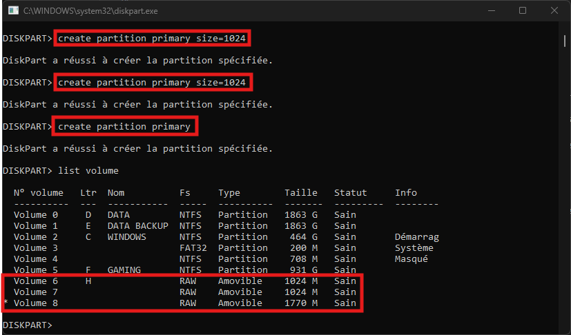
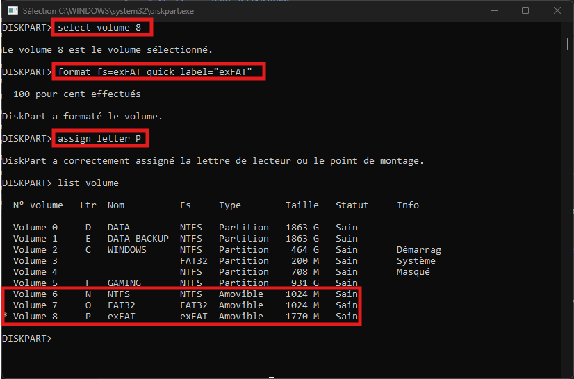
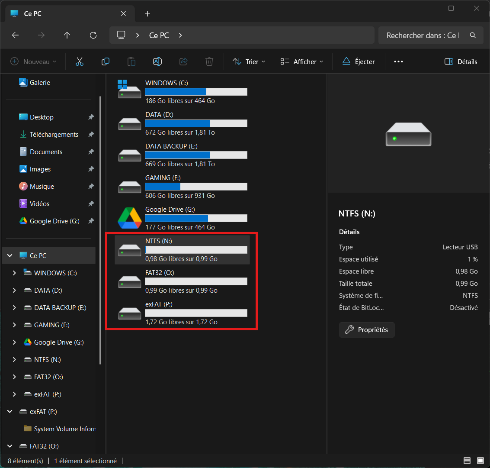
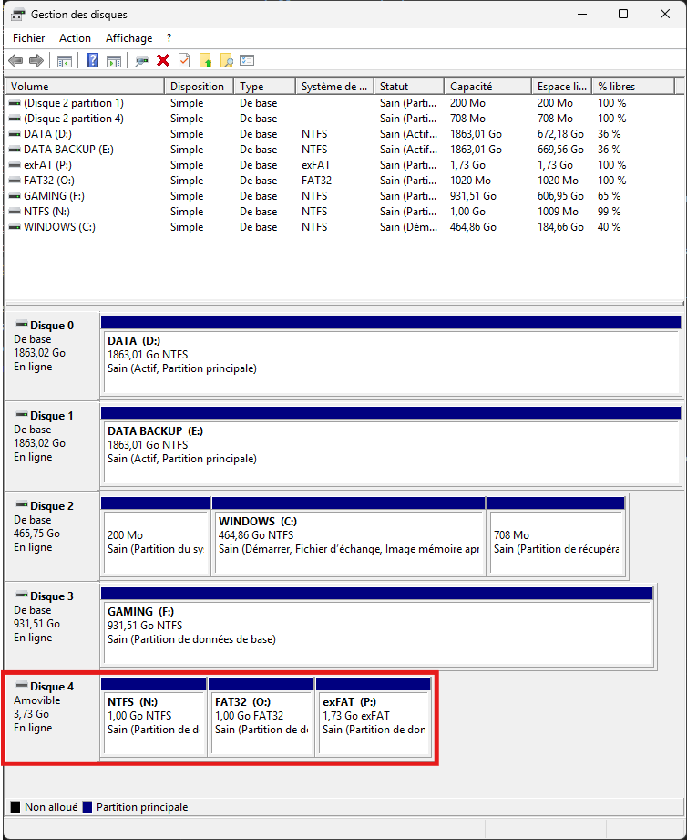
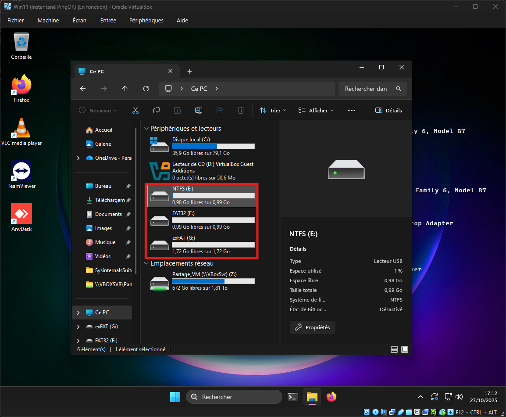
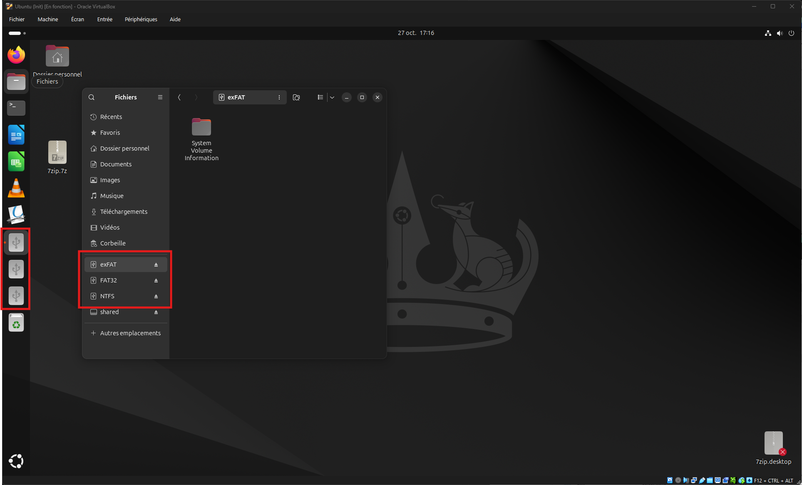
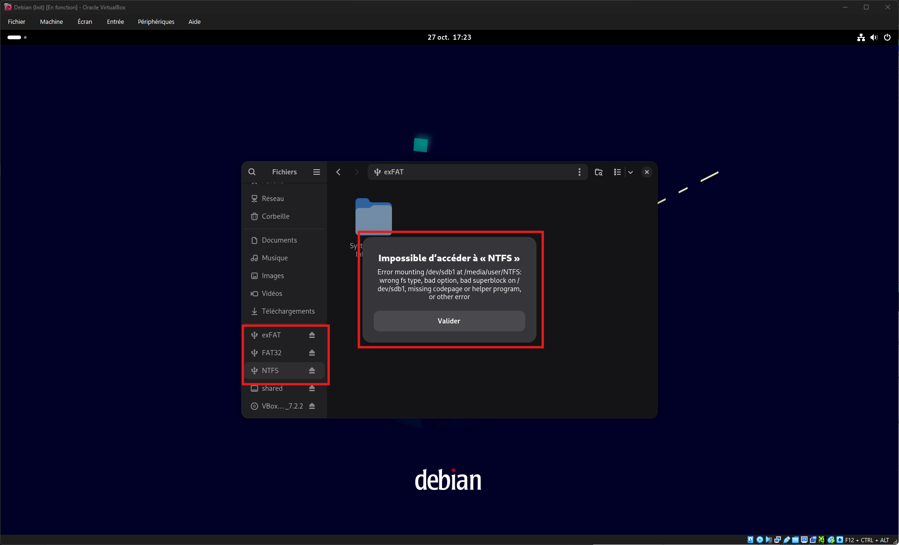
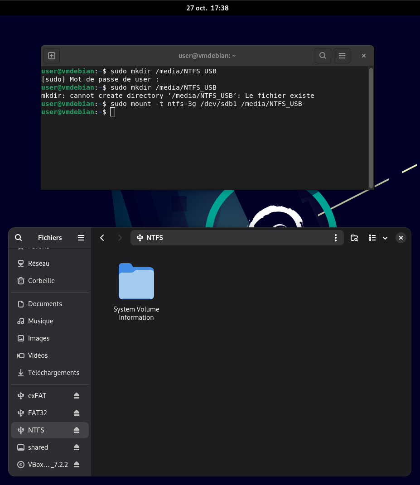

# Challenge A206 27/10/2025

## Pitch de l’exercice 🧑‍🏫

⌨️ Challenge

- Accédez au BIOS de votre ordinateur, et explorez les différentes pages, sections et réglages proposés !

⚠️ Ne modifiez rien, vous risqueriez d’empêcher votre ordinateur de démarrer.

Prenez des photos des pages ou des réglages que vous ne comprenez/connaissez pas.

Pour ceux qui sont sur Mac, pas de BIOS dispo ! Vous pouvez explorer [ce simulateur en ligne](https://xb-16.github.io/BIOS-Emulator-Web-Interface/), ou [celui-ci](https://pranx.com/bios/) ou [encore lui](https://download.lenovo.com/bsco/index.html#/)

- Sauvegardez les données d’une clé USB, puis tentez de :

convertir sa table de partitions de MBR à GPT (ou l’inverse) à l’aide de l’utilitaire DiskPart (depuis une VM Windows, si vous êtes sous MacOS)

créer plusieurs partitions sur cette clé et tester de les formater avec différents systèmes de fichiers : NTFS, FAT32 et ExFAT

testez la compatibilité avec les différents systèmes d’exploitation (en connectant la clé USB sur des VMs VirtualBox)

💡 Vous devrez potentiellement réussir à connecter une clé USB sur une VM VirtualBox. À vous de trouver comment faire !

[Cours A206.](/RESUME.md#-a206-bios-uefi-mbr-et-gpt)

---

## Challenge A206 💽

### BIOS 🤖

Le BIOS est le "tableau de bord" de la carte mère pour configurer et optimiser la machine.

Globalement on y trouve plusieurs parties semblables chez tous les constructeurs :

- Main & Advanced : pour gérer les périphériques matériels (activer ou désactiver les composants intégrés : son réseau, disques etc) et optimiser (OC/Tweaker).

- Security : pour sécuriser la machine dèsn le démarrage avec un mdp.

- Boot : pour définir l'ordre de démarrage (ex pour installer Windows depuis une clé USB).

Ici on peut voir 2 types de BIOS, à l'ancienne interface simple, et UEFI : plus moderne avec une interface graphique (comme mon PC).

### Clef USB 🔑

### Formatage de la Clef

J'ai utilisé une vieille clef USB SANDISK de 4Go. Une fois insérrée dans l'ordi, j'ouvre un terminal puis je lance ``DISKPART``

Je liste mes disques avec ``List Disk``, c'est le disque 4 vu sa taille, et je ne vois pas de ``*`` à côté donc elle n'est pas en **GPT** mai en **MBR** pour le moment.

Les commandes sont simples pour cette partie dans Diskpart : select, clean, format gpt.

Maintenant pour créer plusieurs partitions sur la clef, je vois qu'il y a 3818 Mo de libre. Je vais créer 2 partitions de 1024 Mo et une du reste.

Je selectionne, formate et assigne un nom et une lettre à chaque volume.

Et ils sont direcement reconnus par Windows dans l'explorateur.

Sinon on pouvait aussi tout faire par l'interface Graphique du Gestionaire de Disques.

### test de la Clef sur les VM

Pour tester la clef dans les VM je lance simplement la VM, et dans la fenêtre ``Périphériques / USB`` je sélectionne ma clef.

- Sur les VM Windows 10 et 11 et Ubuntu, les 3 partitions sont détectées et utilisables.

- Sur la VM Debian il y a une erreur pour la partition NTFS, ``wrong fs type`` signifie que Debian ne sais pas lire le système de fichier (fs pour file system).

Après avoir voulu installer le paquet ``ntfs-3g`` (sudo apt update / sudo apt install ntfs-3g) pour lire ce système de fichier, j'ai du forcer son utilisation sur cette partition en créant un point d'entrée sur la clef avec ``sudo mkdir /media/NTFS_USB`` puis  ``sudo mount -t ntfs-3g /dev/sdb1 /media/NTFS_USB`` et ça a fonctionné.

