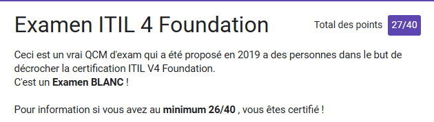

# Challenge A207 29/10/2025

## Pitch de l’exercice 🧑‍🏫

⌨️ Challenge
Ceci est un vrai QCM d’exam qui a été proposé en 2019 a des personnes dans le but de décrocher la certification ITIL V4 Foundation.
C’est un Examen BLANC !

<https://forms.gle/4RcfG8218RVmvuC57>

Pour information si vous avez au minimum 26/40 , vous êtes certifié !

---

## Challenge A207 📝

