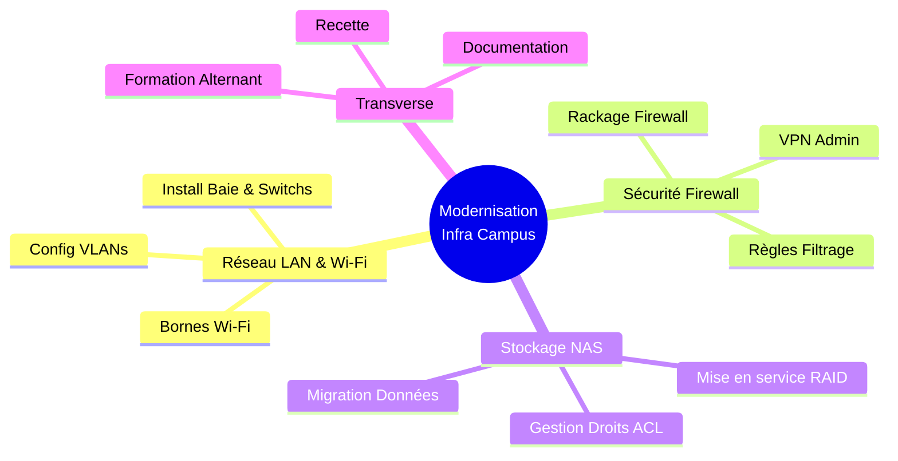

# Challenge C102 10/02/2026

## Pitch de l’exercice 🧑‍🏫

[Challenge C102]<https://kourou.oclock.io/ressources/recap-quotidien/aldebaran-administrateur-cybersecurite-sc01e02-agile-et-outils/>

[Cours C102.](/RESUME.md#-c102-agilité-scrum--outils-projet)

---

Suite à notre fiche de cadrage du projet hier on va effectuer le découpage en WBS, la matrice RACI et le diagramme de Gantt.

### 1. Le WBS (Work Breakdown Structure)

Découpage du projet en Grands Lots (Niveau 1) puis en Tâches (Niveau 2/3)

```mermaid
graph TD
    %% Le Projet Global
    Project[🚀 Projet Modernisation Infra Campus]
    
    %% Les Grands Lots (Niveau 1)
    Lot1[1. Infrastructure Réseau<br/>LAN & Wi-Fi]
    Lot2[2. Sécurité & Périmètre<br/>Firewall]
    Lot3[3. Systèmes & Stockage<br/>NAS & Serveur]
    Lot4[4. Gestion & Transverse<br/>Doc & Formation]

    %% Liaisons Projet -> Lots
    Project --> Lot1
    Project --> Lot2
    Project --> Lot3
    Project --> Lot4

    %% Tâches Lot 1 (Réseau)
    Lot1 --> L1T1[1.1 Installation Physique<br/>Baie & Switchs]
    Lot1 --> L1T2[1.2 Config. Logique<br/>VLANs & Routage]
    Lot1 --> L1T3[1.3 Déploiement Wi-Fi<br/>Bornes & Portail]

    %% Tâches Lot 2 (Sécurité)
    Lot2 --> L2T1[2.1 Install. Physique<br/>Rackage Firewall]
    Lot2 --> L2T2[2.2 Règles de Filtrage<br/>Flux & URL]
    Lot2 --> L2T3[2.3 Accès Distants<br/>VPN Admin]

    %% Tâches Lot 3 (Stockage)
    Lot3 --> L3T1[3.1 Mise en service NAS<br/>RAID & Volumes]
    Lot3 --> L3T2[3.2 Droits & Accès<br/>ACL & Groupes]
    Lot3 --> L3T3[3.3 Migration<br/>Transfert Données]

    %% Tâches Lot 4 (Transverse)
    Lot4 --> L4T1[4.1 Documentation<br/>Plan IP & Schémas]
    Lot4 --> L4T2[4.2 Accompagnement<br/>Formation Alternant]
    Lot4 --> L4T3[4.3 Recette<br/>PV de fin]

    %% Styles (Optionnel pour faire joli)
    style Project fill:#2c3e50,stroke:#34495e,stroke-width:4px,color:#fff
    style Lot1 fill:#3498db,stroke:#2980b9,color:#fff
    style Lot2 fill:#e74c3c,stroke:#c0392b,color:#fff
    style Lot3 fill:#f1c40f,stroke:#f39c12,color:#000
    style Lot4 fill:#9b59b6,stroke:#8e44ad,color:#fff
```

### 2. Matrice RACI : Projet Infra Campus

| Phase / Tâche | Responsable IT | Alternant | Direction | Staff & Profs |
| --- | --- | --- | --- | --- |
| **1. CADRAGE** | | | | |
| Audit de l'existant & Inventaire | **A** | **R** | I | - |
| Définition des besoins & Budget | **R** | C | **A** | C |
| Conception Architecture (VLAN, IP) | **R** | I | I | - |
| **2. DÉPLOIEMENT** | | | | |
| Commande Matériel | **R** | I | **A** | - |
| Installation Physique (Rack, Bornes) | **A** | **R** | I | - |
| Config. Cœur (Firewall, Sécurité) | **R** | I | - | - |
| Config. Accès (Wi-Fi, Postes) | **A** | **R** | - | - |
| **3. CLÔTURE** | | | | |
| Tests & Recette | **A** | **R** | I | C |
| Documentation & Formation | **A** | **R** | I | I |

### 3. Gantt
