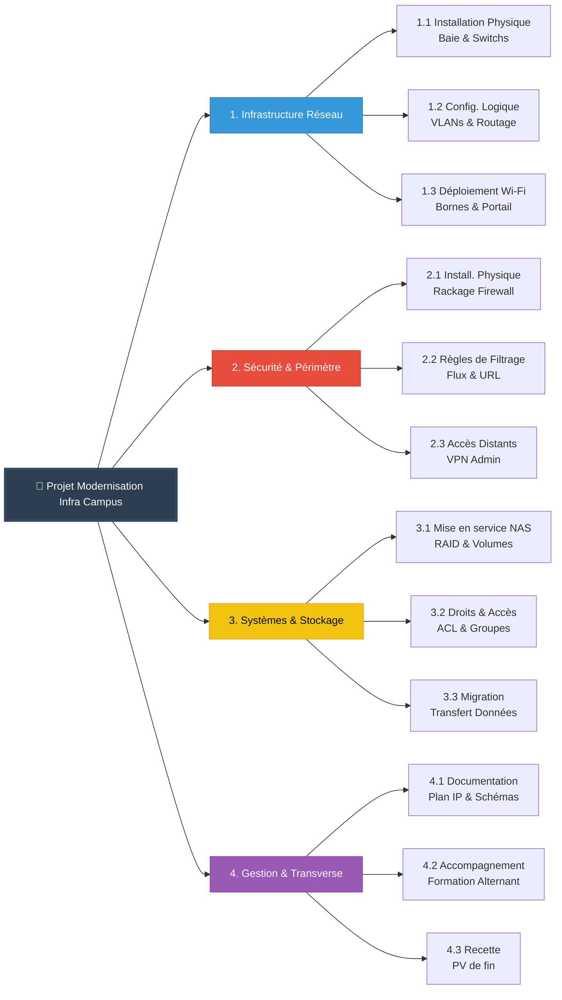

# Challenge C102 10/02/2026

## Pitch de l’exercice 🧑‍🏫

[Challenge C102]<https://kourou.oclock.io/ressources/recap-quotidien/aldebaran-administrateur-cybersecurite-sc01e02-agile-et-outils/>

[Cours C102.](/RESUME.md#-c102-agilité-scrum--outils-projet)

---

Suite à notre fiche de cadrage du projet hier on va effectuer le découpage en WBS, la matrice RACI et le diagramme de Gantt.

### 1. Le WBS (Work Breakdown Structure) 📊

Découpage du projet en Grands Lots (Niveau 1) puis en Tâches (Niveau 2/3)

### 2. Matrice RACI (Alignée WBS) 📋

| WBS | Tâche / Activité | Responsable IT | Alternant | Direction | Staff & Profs |
| --- | --- | --- | --- | --- | --- |
| **1** | **LOT 1 : INFRA RÉSEAU** | | | | |
| 1.1 | Installation Physique (Baie, Câblage) | **A** | **R** | I | - |
| 1.2 | Config. Logique (VLANs, Routage) | **R/A** | C | I | - |
| 1.3 | Déploiement Wi-Fi (Bornes, Portail) | **A** | **R** | - | I |
| **2** | **LOT 2 : SÉCURITÉ (FIREWALL)** | | | | |
| 2.1 | Rackage & Branchement Firewall | **A** | **R** | - | - |
| 2.2 | Règles de Filtrage & URL | **R** | I | **A** | C |
| 2.3 | Config. VPN Admin | **R** | I | - | - |
| **3** | **LOT 3 : STOCKAGE (NAS)** | | | | |
| 3.1 | Mise en service (RAID, Volumes) | **A** | **R** | - | - |
| 3.2 | Gestion des Droits (ACL, Groupes) | **A** | **R** | I | C |
| 3.3 | Migration des Données | **A** | **R** | I | I |
| **4** | **LOT 4 : TRANSVERSE** | | | | |
| 4.1 | Documentation Technique | **A** | **R** | - | - |
| 4.2 | Formation / Transfert de compétences | **R** (Formateur) | **I** (Apprenant) | - | - |
| 4.3 | Recette & PV de fin | **A** | **R** (Exécute les tests) | **I** (Signe) | - |

**R**éalisateur - **A**pprobateur - **C**onsulté - **I**nformé

### 3. Diagramme de Gantt 🗓️

