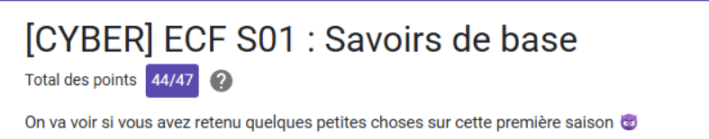
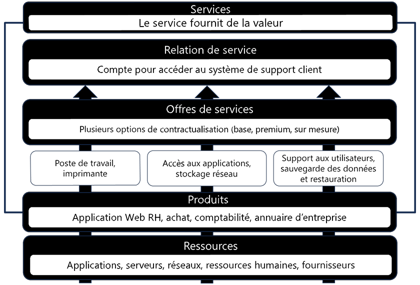

# Résumé des Saisons O'clock

Cette fiche synthétise les notions fondamentales abordées durant les saisons de la formation "Expert Cybersécurité" en vue du Titre Pro "Administrateur d'Infrastructures Sécurisées" et quelques ressources partagées lors des cours.

## **💻 Saison 01 : Savoirs de Base**

> L'objectif de cette saison est de construire un socle de connaissances commun sur le fonctionnement des ordinateurs, des systèmes d'exploitation, des réseaux et de la sécurité.

---

### 🎯 0101. & 0102. Introduction Formation O'clock & Titre Pro AIS

> Cette introduction a permis de présenter le déroulement de la formation, ses objectifs pédagogiques et les attentes pour l'obtention du **Titre Professionnel "Administrateur d'Infrastructures Sécurisées" (AIS)**. L'accent a été mis sur les compétences à acquérir, la méthodologie de travail (projets, veille technologique) et le référentiel du titre pro.

[Challenge 0102](../challenges/Challenge_0102.md)

>Ressources :
>
>* [Titre Pro AIS](https://www.francecompetences.fr/recherche/rncp/37680/)
>* [Le dossier Professionnel](https://www.dossierprofessionnel.fr/)

---

### 📜 0103. Histoire de l'Informatique

> L'informatique est un domaine dont les racines sont bien plus anciennes que les ordinateurs modernes.

* **Les Origines** : Les concepts de base remontent à l'Antiquité avec les algorithmes, comme celui d'**Euclide**. Le mot "algorithme" lui-même dérive du nom du mathématicien **Al-Khwarizmî**.
* **La Programmation Mécanique** : Le premier système mécanique programmable est le **métier à tisser Jacquard**, qui utilisait des cartes perforées. **Ada Lovelace** est reconnue pour avoir écrit le premier véritable programme informatique sur la machine analytique de Charles Babbage au XIXe siècle.
* **L'Ère Moderne** :
  * **Alan Turing** a posé les fondements scientifiques de l'informatique avec la "machine de Turing".
  * **John von Neumann** a défini l'architecture qui est encore utilisée dans la quasi-totalité des ordinateurs modernes.
  * L'invention du **transistor** en 1947 a été une révolution, remplaçant les tubes à vide et permettant la miniaturisation.
  * Le **circuit intégré** (1958) et le **microprocesseur** (1969) ont permis de réduire encore la taille et le coût des ordinateurs.
  * La **loi de Moore** postule que le nombre de transistors sur un microprocesseur double environ tous les deux ans, une tendance qui a guidé l'industrie pendant des décennies.
* **L'Ordinateur Personnel (PC)** : Les années 70 et 80 ont vu l'émergence des micro-ordinateurs accessibles au grand public, avec des machines emblématiques comme l'**Altair 8800**, l'**Apple II**, le **Commodore 64** et l'**IBM PC**.

En résumé :

| Période | Événement/Pionnier | Contribution |
| :--- | :--- | :--- |
| ~300 av. J.-C. | **Euclide** | Création de l'**algorithme d'Euclide**. |
| ~1830 | **Ada Lovelace** | Premier véritable **programme informatique**. |
| ~1936 | **Alan Turing** | Fondements scientifiques (machine de Turing). |
| 1945 | **John Von Neumann** | Architecture de von Neumann (base des PCs modernes). |
| 1947 | **Transistor** | Remplacement des tubes électroniques ; clé de la miniaturisation. |
| 1965 | **Loi de Moore** | Postule que le nombre de transistors double tous les deux ans. |
| 1969 | **Micro-processeur** | Invention du composant central (ex: Intel 4004). |
| 1975 | **Altair 8800** | Lancement de l'ère des micro-ordinateurs personnels. |

[Challenge 0103](../challenges/Challenge_0103.md)

>Ressources :
>
>* [Informatique](https://fr.wikipedia.org/wiki/Informatique)
>* [Machine analytique](https://fr.wikipedia.org/wiki/Machine_analytique)
>* [Algorythme d'Euclide](https://fr.wikipedia.org/wiki/Algorithme_d%27Euclide)
>* [Machine de Turing](https://fr.wikipedia.org/wiki/Machine_de_Turing)
>* [Architecture de Von Neumann](https://fr.wikipedia.org/wiki/Architecture_de_von_Neumann)
>* [Ferranti Mk I](https://fr.wikipedia.org/wiki/Ferranti_Mark_I)
>* [UNIVAC I](https://fr.wikipedia.org/wiki/UNIVAC_I)
>* [PDP-8](https://fr.wikipedia.org/wiki/PDP-8)
>* [Microprocesseur](https://fr.wikipedia.org/wiki/Microprocesseur)
>* [Téléscripteur](https://fr.wikipedia.org/wiki/T%C3%A9l%C3%A9scripteur)

---

### ⚙️ 0104. Les Composants Matériels (Hardware)

> Un ordinateur est constitué d'un ensemble de composants physiques (le hardware) qui interagissent pour fonctionner.

* **La Carte Mère** : C'est le circuit imprimé central qui connecte tous les autres composants. Elle inclut :
  * Le **socket** pour le processeur.
  * Les **slots de mémoire vive (RAM)**.
  * Les **connecteurs d'extension** (ex: PCI Express) pour les cartes additionnelles.
  * Les **connecteurs de stockage** (ex: SATA, M.2) pour les disques durs et SSD.
  * Le **BIOS/UEFI**, un micrologiciel qui initialise le matériel au démarrage.
* **Le Processeur (CPU)** : C'est le "cerveau" de l'ordinateur qui exécute les calculs et les instructions. Ses performances dépendent de sa **fréquence** (en GHz) et de son **nombre de cœurs**. Il doit être refroidi, généralement par un **ventirad** (ventilateur + radiateur) avec de la **pâte thermique** pour assurer le transfert de chaleur.
* **La Mémoire Vive (RAM)** : C'est la mémoire de travail, rapide mais **volatile** (elle perd ses données quand l'ordinateur est éteint). On la trouve sous forme de barrettes (DIMM pour les PC fixes, SO-DIMM pour les portables).
* **Le Stockage** : C'est la mémoire de masse, non volatile, où sont stockés le système d'exploitation, les logiciels et les fichiers.
  * **Disque Dur (HDD)** : Technologie magnétique plus ancienne, à disques tournants.
  * **SSD (Solid-State Drive)** : Technologie plus récente basée sur de la **mémoire flash**, beaucoup plus rapide et résistante aux chocs.
* **La Carte Graphique (GPU)** : C'est une carte d'extension dédiée à la production et à l'affichage des images sur un écran. Elle est essentielle pour les jeux vidéo et les applications graphiques intensives.
* **L'Alimentation (PSU)** : C'est le bloc qui convertit le courant alternatif du secteur en tensions continues pour alimenter tous les composants. Sa capacité est mesurée en **Watts (W)**.
* **Les Périphériques** : Ce sont des dispositifs connectés à l'ordinateur pour lui ajouter des fonctionnalités. Ils se classent en trois catégories :
  * **Périphériques d'entrée** : Clavier, souris, webcam, micro.
  * **Périphériques de sortie** : Écran, imprimante, haut-parleurs.
  * **Périphériques d'entrée-sortie** : Clé USB, disque dur externe, écran tactile.

[Challenge 0104](../challenges/Challenge_0104.md)

>Ressources :
>
>* [Composants d'un PC](https://www.malekal.com/les-composants-hardware-et-materiel-dun-pc-le-dossier/)
>* [Cache de Processeur](https://fr.wikipedia.org/wiki/Cache_de_processeur)
>* [Architecture mémoire multi canaux](https://fr.wikipedia.org/wiki/Architecture_de_m%C3%A9moire_%C3%A0_multiples_canaux)
>* [PC Builder](https://fr.pcpartpicker.com/list/)

---

### 💿 0105. Le Système d'Exploitation (OS)

> Le système d'exploitation (OS) est le logiciel principal qui sert d'intermédiaire entre le matériel et les applications logicielles. Les plus courants sur ordinateur sont Windows, macOS et GNU/Linux.

* **Le Noyau (Kernel)** : C'est le cœur de l'OS. Il gère les ressources matérielles (mémoire, processeur), l'exécution des programmes, les périphériques et les systèmes de fichiers.
* **Les Interfaces** : Pour interagir avec le noyau, on utilise :
  * L'**interface graphique (GUI)** : Menus, icônes, fenêtres (ex: le bureau Windows).
  * L'**interface en ligne de commande (CLI)** : Terminal où l'on tape des commandes textuelles (ex: `shutdown`).
  * L'**interface de programmation (API)** : Utilisée par les programmes pour demander des services à l'OS.
* **Concepts Clés** :
  * **Processus** : Un programme en cours d'exécution.
  * **Système Multitâches** : Capacité de l'OS à exécuter plusieurs programmes de façon "simultanée" en alternant très rapidement entre eux.
  * **Pilotes (Drivers)** : Programmes spécifiques qui permettent à l'OS de communiquer avec un périphérique matériel.
* **Installation d'un OS** :
  * Se fait généralement à partir d'un **média d'installation** (clé USB ou DVD).
  * Ce média est créé à partir d'une **image ISO**, qui est une copie conforme d'un disque.
  * Il faut configurer le **BIOS/UEFI** de l'ordinateur pour qu'il démarre ("boot") sur ce média d'installation.

[Challenge 0105](../challenges/Challenge_0105.md)

>Ressources :
>
>* [Commandes Ubuntu](https://doc.ubuntu-fr.org/tutoriel/console_commandes_de_base)
>* [Les distributions Linux](https://alexblog.fr/wp-content/uploads/2011/01/evolution-linux-distributions.jpg)

---

### 🔢 0106. Numération : Bits et Octets

> Les ordinateurs fonctionnent avec un système binaire, qui est la base de toute information numérique.

* **Bit et Octet** :
  * Le **bit** (binary digit) est la plus petite unité d'information et peut avoir deux valeurs : 0 ou 1.
  * Un **octet** (Byte en anglais) est un groupe de 8 bits.
* **Multiples** : Il existe une confusion fréquente entre les multiples décimaux (base 10) et binaires (base 2).
  * **Préfixes SI (décimaux)** : kilooctet (ko) = 1000 octets, mégaoctet (Mo) = 1 000 000 octets.
  * **Préfixes binaires** : kibioctet (Kio) = 1024 octets, mébioctet (Mio) = 1 048 576 octets.
  * C'est pourquoi un disque dur de 1 Téraoctet (To) est affiché par le système d'exploitation comme ayant environ 930 Gibioctets (Go).
* **Systèmes de Numération** :
  * **Binaire (base 2)** : Utilise les chiffres 0 et 1.
  * **Décimal (base 10)** : Le système que nous utilisons tous les jours (0-9).
  * **Hexadécimal (base 16)** : Utilise les chiffres 0-9 et les lettres A-F. Souvent utilisé en informatique pour représenter des valeurs binaires de manière plus compacte.
* **Encodage des Caractères** : Pour représenter du texte, chaque caractère est associé à un nombre.
  * **ASCII** : Une des premières normes, limitée à 128 caractères (principalement pour l'anglais).
  * **Unicode (UTF-8)** : La norme moderne qui peut représenter la quasi-totalité des systèmes d'écriture du monde, y compris les accents et les emojis.

[Challenge 0106](../challenges/Challenge_0106.md)

---

### 🌐 0107. Introduction aux Réseaux Informatiques

> Un réseau est un ensemble d'équipements informatiques connectés entre eux pour partager des ressources et communiquer.

* **Types de Réseaux (par étendue)** :
  * **LAN (Local Area Network)** : Réseau local (ex: à la maison, dans une entreprise).
  * **WAN (Wide Area Network)** : Réseau étendu qui connecte plusieurs LAN sur de longues distances. **Internet** est le plus grand des WAN.
* **Topologies de Réseau** : C'est la manière dont les équipements sont interconnectés.
  * **En étoile** : Tous les équipements sont connectés à un point central (un switch). C'est la topologie la plus courante pour les réseaux LAN.
  * Autres topologies : en bus, en anneau, maillée.
* **Adressage IP (IPv4)** :
  * Chaque machine sur un réseau a une **adresse IP** unique pour être identifiée, comme une adresse postale.
  * Une adresse IPv4 est composée de 4 nombres entre 0 et 255 (ex: `192.168.1.10`). C'est une adresse de 32 bits (4 octets).
  * Le **masque de sous-réseau** (ex: `255.255.255.0`) permet de diviser l'adresse IP en deux parties : une partie qui identifie le **réseau** et une partie qui identifie la **machine** sur ce réseau.
  * Deux machines peuvent communiquer directement seulement si elles sont sur le **même réseau**, c'est-à-dire si elles ont la même partie réseau.
* **Diagrammes Réseau** : Ce sont des schémas qui représentent l'organisation d'un réseau.
  * **Diagramme Physique** : Montre l'emplacement réel des équipements et leur câblage.
  * **Diagramme Logique** : Montre comment les informations circulent, les adresses IP, les sous-réseaux, etc.

[Challenge 0107](../challenges/Challenge_0107.md)

>Ressources :
>
>* [Le virus Stuxnet](https://www.youtube.com/watch?v=gXtp6C-3JKo)
>* [Le cas Ledger](https://www.youtube.com/watch?v=4nXEfsQalkI)
>* [Le cas Proton](https://www.youtube.com/watch?v=-pSdE6jjdG0)
>* [Top 10 Web Application Security Risks](https://owasp.org/www-project-top-ten/)
>* [Mitre-CVE version Européenne (car le Mitre à failli sauter avec les coupes de Trump)](https://euvd.enisa.europa.eu/)
>* [Loi informatique et Libertés](https://fr.wikipedia.org/wiki/Loi_informatique_et_libert%C3%A9s)

---

### 🛡️ 0108. Sécurité Informatique

> La sécurité informatique vise à protéger les systèmes d'information contre les menaces et à garantir leur bon fonctionnement.

* **Les 5 Piliers de la Sécurité** :
    1. **Confidentialité** : S'assurer que seules les personnes autorisées peuvent accéder aux données.
    2. **Intégrité** : Garantir que les données n'ont pas été modifiées de manière non autorisée.
    3. **Disponibilité** : S'assurer que le système et les données sont accessibles lorsque l'on en a besoin.
    4. **Authentification** : Vérifier l'identité d'un utilisateur.
    5. **Non-répudiation (ou Traçabilité)** : S'assurer qu'un utilisateur ne peut pas nier avoir effectué une action.
* **Grands Principes** :
  * **Défense en profondeur** : Mettre en place plusieurs couches de sécurité.
  * **Principe du moindre privilège** : Donner aux utilisateurs uniquement les droits nécessaires pour accomplir leurs tâches.
  * La sécurité absolue n'existe pas ; il faut se préparer à l'échec (sauvegardes, plans de reprise).
  * L'utilisateur est souvent le maillon le plus faible de la chaîne de sécurité.
* **Bonnes Pratiques** :
  * **Mots de passe** : Utiliser un **gestionnaire de mots de passe** pour créer et stocker des mots de passe longs, uniques et aléatoires pour chaque service.
  * **Authentification multifacteur (MFA/2FA)** : Activer une deuxième étape de vérification (ex: un code sur le téléphone) en plus du mot de passe.
* **Cryptographie** :
  * **Hachage** : Transformation irréversible d'une donnée en une chaîne de caractères de taille fixe. Utilisé pour vérifier l'intégrité d'un fichier ou stocker des mots de passe.
  * **Chiffrement** : Transformation réversible d'une donnée à l'aide d'une clé pour la rendre illisible.
    * **Symétrique** : La même clé est utilisée pour chiffrer et déchiffrer.
    * **Asymétrique** : Utilise une paire de clés (une publique pour chiffrer, une privée pour déchiffrer).

[Challenge 0108](../challenges/Challenge_0108.md)

>Ressources :
>
>* [Antivirus](https://fr.wikipedia.org/wiki/Logiciel_antivirus)
>* [Exemple Social Engineering : Hushpuppy](https://etudestech.com/decryptage/portrait-arnaquer-hushpuppi-hacker/)
>* [Chiffrer et pas Crypter](https://chiffrer.info/)
>* [Chiffrement Asymétrique + Symétrique](https://fr.wikipedia.org/wiki/%C3%89change_de_cl%C3%A9s_Diffie-Hellman)
>* [Comprendre le chiffrement](https://www.youtube.com/watch?v=7W7WPMX7arI)
>* [Télégraphe de Chappe](https://fr.wikipedia.org/wiki/T%C3%A9l%C3%A9graphe_Chappe)
>* [Préfixe Binaire](https://fr.wikipedia.org/wiki/Pr%C3%A9fixe_binaire)
>* [Tableau de Calcul Binaire](https://lesitedelaclasse.fr/wp-content/uploads/2018/12/tableau-binaire.png)
>* [Table de Conversion](http://yannklein.free.fr/cours/reseau/conversion.html)
>* [Convertisseur](https://www.rapidtables.org/fr/convert/number/binary-to-decimal.html?x=1111)
>* [Encodage de nos lettres UTF-8](https://www.malekal.com/utf-8-comment-ca-marche/)

---

### 🧮 0109. Atelier calcul d'adresse IP et Masque sous-réseau

> Cet atelier pratique a permis de mettre en application les concepts de l'adressage IPv4.

L'objectif était de pouvoir, à partir d'une adresse IP et de son masque, déterminer les informations essentielles d'un sous-réseau :

* L'adresse du réseau.
* L'adresse de broadcast (diffusion).
* La première et la dernière adresse IP utilisables pour des machines.

La **Méthode de calcul Binaire** avec l'utilisation du *ET Logique* pour l'adresse réseau et du *OU logique* pour l'adresse de broadcast.

* (Adresse IP) **ET** (masque de sous-réseau) = adresse Réseau
* (**NOT** masque sous-réseau) **OU** (adresse réseau) = adresse Broadcast

La **Méthode du Nombre Magique** (basée sur l'octet significatif du masque) a été présentée comme une technique rapide pour effectuer ces calculs sans conversion binaire complète.

* Octet Significatif
* 256- OS = Nombre magique
* Calcul avec les multiples de l'adresse réseau et broadcast

> Ressources :
>
>* [Logique ET OU](https://github.com/GitFreed/Challenges-O-clock/blob/main/images/Logique.jpg)
>* [Méthode du nombre magique](https://zestedesavoir.com/tutoriels/321/calculer-une-plage-dadresses-avec-la-methode-magique/#2-10258_quest-ce-que-la-methode-magique)
>* [Table masque de sous réseau, binaire et hôtes](https://www.it-connect.fr/wp-content-itc/uploads/2021/05/reseau-adresse-ipv4-calcul-masque-sous-reseau-12.png)
>* [CIDR Calculator](https://www.subnet-calculator.com/cidr.php)

[Challenge 0109](../challenges/Challenge_0109.md)

---

## **💻 FIN Saison 01 : Savoirs de Base**

[QCM Saison 01](https://forms.gle/MofrrYWGy8XXPN6D7)

---

## **🛠️ Saison 02 : Support aux Utilisateurs**

> Cette saison se concentre sur les outils et méthodes pour assister les utilisateurs, diagnostiquer et résoudre les incidents courants sur les postes de travail, etc.

---

### 💼 0201. Outils Bureautiques

> Ce cours présente les suites bureautiques, des ensembles de logiciels essentiels pour la productivité en entreprise.

* **Suite Microsoft Office** : La suite la plus répandue, développée par Microsoft.
  * **Composants principaux** : **Word** (traitement de texte), **Excel** (tableur), **PowerPoint** (présentation) et **Outlook** (messagerie).
  * **Versions** : Il existe des versions sous **licence perpétuelle** (ex: Office 2024) et des versions par **abonnement** basées sur le cloud (**Microsoft 365**), qui incluent des services comme OneDrive et permettent la collaboration en temps réel.

* **LibreOffice** : Une alternative **gratuite et open-source** à Microsoft Office.
  * **Équivalents** : Elle propose des logiciels similaires comme **Writer** (Word), **Calc** (Excel), **Impress** (PowerPoint) et **Base** (Access).
  * **Avantages** : Elle est multiplateforme, compatible avec les formats de fichiers Microsoft et n'implique aucun coût de licence.

* **Collaboration et Partage** : Les outils modernes, notamment ceux basés sur le cloud, facilitent le travail d'équipe grâce au partage de fichiers et à la co-édition de documents en temps réel.

[Challenge 0201](../challenges/Challenge_0201.md)

>Ressources :
>
>* [Autoformation aux bases de la bureautique](http://clic-formation.net/)
>* [Base de donnée de logiciels alternatifs](https://alternativeto.net/)
>* [Site comparatif de solutions alternatives d'entreprises](https://www.capterra.fr/)

---

### 🔍 0202. Diagnostic et Résolution d'Incidents

> Ce cours aborde les outils et les procédures pour diagnostiquer et résoudre les problèmes sur un système d'exploitation Windows.

* **Outils de diagnostic natifs de Windows** :
  * **Gestionnaire des tâches** : Pour surveiller les processus, les performances (CPU, mémoire) et gérer les applications au démarrage.
  * **Observateur d'événements** : Pour consulter les journaux système et identifier les erreurs, avertissements et événements critiques qui peuvent causer des instabilités.
  * **Éditeur du Registre (Regedit)** : Permet de modifier la base de données de configuration de Windows. Une manipulation incorrecte peut endommager gravement le système.
  * **Gestionnaire de périphériques** : Pour gérer les pilotes (drivers) des composants matériels et identifier les conflits ou les dysfonctionnements.

* **Dépannage du démarrage de Windows** :
  * **Processus de démarrage** : Implique des composants clés comme **BootMGR** (gestionnaire de démarrage), **Winload.exe** (chargeur de l'OS) et le **BCD** (base de données de configuration du démarrage).
  * **Outils de réparation** :
    * **`bootrec`** : Commande pour réparer le MBR, le secteur de démarrage et reconstruire le BCD.
    * **`chkdsk`** : Pour vérifier et réparer les erreurs sur le disque dur.
    * **Options de démarrage avancé** : Permet d'accéder au mode sans échec, à la restauration du système ou à l'invite de commandes de récupération.

* **Sauvegarde et Récupération** :
  * **Restauration du système** : Permet de revenir à un point de restauration antérieur pour annuler des modifications qui ont causé un problème.
  * **Historique des fichiers** : Sauvegarde automatiquement différentes versions de vos fichiers personnels.
  * **Image système** : Crée une copie complète du système pour une restauration totale en cas de panne majeure.

* **Logiciels tiers utiles** :
  * Des outils comme **CCleaner** pour le nettoyage, **Malwarebytes** pour la sécurité, ou **AOMEI Backupper** pour des sauvegardes avancées peuvent compléter les fonctionnalités natives de Windows.

[Challenge 0202](../challenges/Challenge_0202.md)

>Ressources :
>
>* [Sysinternals](https://learn.microsoft.com/fr-fr/sysinternals/)
>* [Autocomplétion des CMD Terminal](https://github.com/chrisant996/clink)

---

### 🔁 0203. Contrôle à distance

>Ressources :
>
>* [Les réseaux virtuels sur virtualbox](https://www.it-connect.fr/comprendre-les-differents-types-de-reseaux-virtualbox/)
>* [Les réseaux virtuels sur vmware](https://www.it-connect.fr/comprendre-les-differents-types-de-reseaux-de-vmware-workstation-pro/)
>* [WinRM](https://www.it-connect.fr/chapitres/utiliser-winrm-pour-la-gestion-a-distance/)
>* [MobaXterm](https://mobaxterm.mobatek.net/)
>* [Ruskdesk](https://rustdesk.com/fr/) et [Ruskdesk Github](https://github.com/rustdesk/rustdesk)

---

### 🔩 0204. Incidents Hardware et Réglementation

> Ce cours couvre la méthodologie de diagnostic des pannes matérielles, ainsi que les cadres réglementaires essentiels liés à la gestion des équipements informatiques en fin de vie (DEEE) et à la protection des données personnelles (RGPD).

* **Diagnostic des Pannes Matérielles** :
  * **Premières étapes** : Avant toute intervention complexe, il est crucial d'effectuer des vérifications simples : nettoyer la poussière, débrancher les périphériques non essentiels, tester les câbles et analyser les messages d'erreur au démarrage.
  * **Isoler le problème** : Une approche méthodique consiste à tester les composants un par un pour identifier la source de la panne. Les causes fréquentes d'un écran noir incluent l'alimentation, la carte graphique, la mémoire RAM ou la pile du BIOS.
  * **Outils de diagnostic** :
    * **Logiciels** : Des outils spécialisés permettent de tester la stabilité et les performances de chaque composant une fois le PC démarré :
      * **CPU-Z** pour le processeur et la carte graphique.
      * **MemTest86** pour la mémoire RAM.
      * **CrystalDiskInfo** pour l'état de santé des disques durs et SSD.
      * **OCCT** pour tester l'alimentation en charge.
    * **Matériel** : Un **multimètre** peut être utilisé pour vérifier les tensions de sortie de l'alimentation.

* **Réglementation DEEE (Déchets d'Équipements Électriques et Électroniques)** :
  * **Objectif** : Encadrer la collecte et le recyclage des équipements en fin de vie pour limiter leur impact environnemental, dû aux matériaux polluants qu'ils contiennent (plomb, mercure).
  * **Obligations des entreprises** : Les professionnels doivent trier leurs DEEE, les confier à une filière de recyclage agréée et s'assurer de la **destruction sécurisée des données** présentes sur les supports de stockage. Des outils comme **DBAN** peuvent être utilisés pour cela.

* **Réglementation RGPD (Règlement Général sur la Protection des Données)** :
  * **Objectif** : Protéger les **données personnelles** des citoyens de l'Union Européenne et encadrer leur traitement par les organisations.
  * **Principes clés** : Le traitement des données doit être légal, limité à des finalités précises (minimisation), et les données doivent être conservées de manière sécurisée et confidentielle pour une durée limitée.
  * **Rôle de la CNIL** : En France, la **Commission Nationale de l'Informatique et des Libertés (CNIL)** est l'autorité chargée de veiller au respect du RGPD. Elle informe, contrôle et peut sanctionner les entreprises en cas de manquement.
  * **En cas de violation de données** : L'entreprise a l'obligation de notifier la CNIL dans les 72 heures et d'informer les personnes concernées si le risque pour leurs droits et libertés est élevé.

[Challenge 0203](../challenges/Challenge_0203.md)

>Ressources :
>
>* [DEEE](https://www.economie.gouv.fr/cedef/fiches-pratiques/gestion-et-traitement-des-dechets-dequipements-electriques-et-electroniques)
>* [CNIL - RGPD](https://www.cnil.fr/fr/reglement-europeen-protection-donnees)

---

### 💻 0205. Atelier Mme Michu 👵🐶

> L'atelier « Mme Michu » a servi de cas pratique pour appliquer les concepts vu précédemment, en simulant un dépannage complet : réparation du démarrage de Windows, résolution d'une surcharge CPU/RAM, vérification de l'état des disques et restauration de fichiers disparus.

[Challenge 0204](../challenges/Challenge_0204.md)

> Ressources :
>
>* [Lignes cmd BCDBoot](https://learn.microsoft.com/fr-fr/windows-hardware/manufacture/desktop/bcdboot-command-line-options-techref-di?view=windows-11)
>* [Process Démarrage Windows](https://www.malekal.com/processus-demarrage-windows-mbr/)

---

### 💾 0206. BIOS, UEFI, MBR et GPT

> Ce cours explore les firmwares qui gèrent le démarrage de l'ordinateur (BIOS et UEFI) et les structures de partitionnement des disques durs (MBR et GPT) qui organisent les données.

* **Le Firmware : BIOS vs UEFI** :
  * **BIOS (Basic Input/Output System)** : Ancien firmware stocké sur une puce de la carte mère, responsable de l'initialisation du matériel au démarrage (POST - Power-On Self Test).
    * **Limitations** : Interface textuelle (navigation au clavier), mode 16 bits, et incapacité à gérer des disques de plus de 2 To.
  * **UEFI (Unified Extensible Firmware Interface)** : Le successeur moderne du BIOS.
    * **Avantages** : Interface graphique (support de la souris), fonctionnement en 32/64 bits, et prise en charge des disques de plus de 2 To grâce au GPT.
    * **Fonctionnalités avancées** :
      * **Secure Boot** : Empêche l'exécution de chargeurs de démarrage non signés pour protéger contre les malwares au démarrage.
      * **Fast Boot** : Accélère le démarrage en sautant certaines étapes d'initialisation matérielle.
  * **Mise à jour (Flasher)** : Mettre à jour le firmware (BIOS/UEFI) peut améliorer la stabilité et la compatibilité, mais une erreur durant le processus peut rendre la carte mère inutilisable.

* **Partitionnement de Disque : MBR vs GPT** :
  * **MBR (Master Boot Record)** : Ancien standard de partitionnement.
    * **Structure** : Stocke les informations de démarrage et la table des partitions dans le premier secteur du disque.
    * **Limitations** : Limité à 4 partitions principales et à des disques de 2 To maximum. Vulnérable car les informations de démarrage sont stockées à un seul endroit.
  * **GPT (GUID Partition Table)** : Le standard moderne, associé à l'UEFI.
    * **Avantages** : Supporte jusqu'à 128 partitions, gère des disques de très grande taille (plus de 2 To), et offre une meilleure protection contre la corruption des données grâce à des copies de sauvegarde de la table de partition.

* **Les Systèmes de Fichiers** : Ils organisent la manière dont les données sont stockées sur une partition.
  * **NTFS (New Technology File System)** : Le système de fichiers par défaut de Windows. Robuste, il gère les grands fichiers et offre des fonctionnalités de sécurité avancées (chiffrement, permissions).
  * **FAT32 (File Allocation Table 32)** : Ancien système de fichiers très compatible avec la plupart des appareils (clés USB, cartes mémoire). Sa principale limitation est qu'il ne peut pas gérer les fichiers de plus de 4 Go.
  * **exFAT (Extended File Allocation Table)** : Conçu pour les supports amovibles, il combine la large compatibilité de FAT32 avec la capacité de gérer des fichiers de plus de 4 Go, ce qui en fait un excellent choix pour les disques durs externes et les clés USB de grande capacité.

[Challenge 0206](../challenges/Challenge_0206.md)

> Ressources :
>
>* [2 Versions BIOS historiques](https://www.quora.com/What-are-the-differences-between-AMI-and-AWARD-BIOSes-1)
>* [Boot PXE](https://www.it-connect.fr/le-boot-pxe-et-le-boot-ipxe-pour-les-debutants/)
>* [GUID Partition Table](https://fr.wikipedia.org/wiki/GUID_Partition_Table)
>* [MBR vs GPT](https://www.simplylinuxfaq.com/2017/10/main-differences-between-mbr-gpt.html)

---

### 📝 0207. & 0208. ITIL

> [Ce cours](https://gamma.app/docs/ITIL-V4-naxpqmck8b6yltv?mode=doc) introduit ITIL (Information Technology Infrastructure Library), un référentiel de meilleures pratiques pour la gestion des services informatiques ITSM (Information Technology Service Management).

* **Qu'est-ce qu'ITIL ?**
    ITIL est un ensemble de bonnes pratiques destiné aux entreprises pour gérer au mieux leurs services informatiques. L'objectif principal est d'aligner les services informatiques sur les besoins métier afin de créer de la **valeur**. ITIL n'est pas une norme rigide mais un **cadre** (framework) qui fournit des recommandations. Il n'existe pas de "certification ITIL" pour une entreprise, mais des certifications individuelles pour les professionnels.

* **Historique** :
    Développé dans les années 1980 par le gouvernement britannique, ITIL visait à standardiser la gestion des services informatiques. Il a depuis évolué à travers plusieurs versions pour s'adapter aux changements technologiques et aux nouvelles méthodologies. **ITIL 4**, la version actuelle, est conçu pour être plus flexible et s'intégrer avec d'autres cadres comme **Agile, DevOps et Lean**.
  * * *Agile est une approche de gestion de projet qui privilégie la flexibilité et la collaboration. Le travail est découpé en cycles courts et itératifs (appelés "sprints") pour s'adapter rapidement aux changements.*
  * * *DevOps est une culture qui vise à unifier le développement (Dev) et les opérations (Ops) pour livrer des applications et des services plus rapidement et de manière plus fiable, en s'appuyant sur l'automatisation et la collaboration.*
  * * *Lean est une philosophie axée sur l'optimisation des processus en éliminant tout gaspillage ("waste") afin de maximiser la valeur pour le client avec le moins de ressources possible.*

* **Concepts Clés de la Gestion des Services** :
  * **Valeur** : Le bénéfice perçu, l'utilité et l'importance de quelque chose. La valeur est toujours **co-créée** par une collaboration active entre le fournisseur de services et le consommateur.
  * **Service** : Un moyen de co-créer de la valeur en facilitant les **résultats** que les clients souhaitent obtenir, sans qu'ils aient à gérer les **coûts** et les **risques** spécifiques.
  * **Produit** : Une configuration des ressources d'une organisation, conçue pour offrir de la valeur à un consommateur. Les services sont basés sur des produits.
  * **Relation de service** : Comprend la **fourniture de service** (par le fournisseur), la **consommation de service** (par le consommateur) et la **gestion de la relation** pour assurer la co-création de valeur.

* **Le Système de Valeur des Services (SVS)** :
    Le SVS décrit comment tous les composants et activités d'une organisation fonctionnent ensemble comme un système pour faciliter la création de valeur. Il transforme une **opportunité** ou une **demande** en **valeur** pour les parties prenantes. Ses 5 composants principaux sont :
    1. **Les Principes Directeurs ITIL** : Recommandations qui guident une organisation en toutes circonstances.
    2. **La Gouvernance** : Les moyens par lesquels une organisation est dirigée et contrôlée.
    3. **La Chaîne de Valeur des Services (SVC)** : Le modèle opérationnel central du SVS.
    4. **Les Pratiques ITIL** : Ensembles de ressources pour accomplir un travail (anciennement "processus").
    5. **L'Amélioration Continue** : Une activité récurrente à tous les niveaux pour s'assurer que les performances répondent aux attentes.

* **Les Sept Principes Directeurs** :
    Ce sont des recommandations universelles et durables qui guident les décisions et les actions.
    1. **Privilégier la valeur** : Tout doit contribuer, directement ou indirectement, à la création de valeur.
    2. **Commencer là où vous êtes** : Ne pas repartir de zéro ; évaluer et tirer parti de ce qui existe déjà.
    3. **Progresser par itérations avec des retours** : Organiser le travail en petites parties gérables pour livrer des résultats plus rapidement et s'ajuster grâce aux retours.
    4. **Collaborer et promouvoir la visibilité** : Travailler ensemble et partager les informations pour prendre de meilleures décisions.
    5. **Penser et travailler de façon holistique** : Avoir une vision d'ensemble et comprendre comment les différentes parties du système interagissent.
    6. **Opter pour la simplicité et rester pratique** : Éliminer tout ce qui n'apporte pas de valeur et choisir la solution la plus simple et efficace.
    7. **Optimiser et automatiser** : Maximiser la valeur du travail en optimisant les processus avant de les automatiser.

* **Les Quatre Dimensions de la Gestion des Services** :
    Pour une approche holistique, ITIL 4 identifie quatre dimensions à considérer pour chaque service.
    1. **Organisations et personnes** : Culture, structure, rôles et compétences.
    2. **Information et technologie** : Les informations, connaissances et technologies nécessaires.
    3. **Partenaires et fournisseurs** : Les relations avec les autres organisations impliquées.
    4. **Flux de valeur et processus** : Les activités et workflows qui permettent la création de valeur.

* **La Chaîne de Valeur des Services (SVC)** :
    C'est le cœur du SVS. Elle représente un modèle opérationnel de six activités qui peuvent être combinées pour créer différents **flux de valeur** afin de répondre à la demande.
    1. **Planifier** : Assurer une compréhension partagée de la vision et de la direction.
    2. **Améliorer** : Assurer l'amélioration continue des produits et services.
    3. **Engager** : Comprendre les besoins des parties prenantes et maintenir de bonnes relations.
    4. **Concevoir et assurer la transition** : S'assurer que les services répondent aux attentes en termes de qualité, de coût et de délai.
    5. **Obtenir/construire** : S'assurer que les composants de service sont disponibles quand et où ils sont nécessaires.
    6. **Fournir et assurer le support** : S'assurer que les services sont fournis et supportés conformément aux attentes.

* **Quelques Pratiques ITIL Clés** :
  * **Amélioration continue** : Aligner les services sur les besoins métier en constante évolution.
  * **Contrôle des changements** : Maximiser le nombre de changements réussis en évaluant les risques.
  * **Gestion des incidents** : Rétablir le fonctionnement normal du service le plus rapidement possible.
  * **Gestion des problèmes** : Réduire la probabilité et l'impact des incidents en identifiant leurs causes profondes.
  * **Gestion des demandes de service** : Gérer les demandes prédéfinies des utilisateurs (ex: demande d'information, d'accès).
  * **Centre de services (Service Desk)** : Le point de contact unique entre le fournisseur et les utilisateurs.
  * **Gestion des niveaux de service (SLM)** : Définir des cibles de performance claires pour les services (SLA).

[Challenge 0207](../challenges/Challenge_0207.md)

> Ressources :
>
>* [PDF ITIL](../images/ITIL%20V4%20-%20Foundation%20-%20Axelos.pdf)
>* [Manifeste Agile](https://manifesteagile.fr/)

---

###
